# DataAnalysis — extracted outputs
Source: `research/AAVE/DataAnalysis.ipynb`
---
## 1. Reading data

```python
import sys
import os

sys.path.insert(0, "/Users/stepan/Desktop/hyperliquid-hft")
os.chdir("/Users/stepan/Desktop/hyperliquid-hft")

from analysis.readers import LobReaderRaw, LobReader, TradesReaderRaw, TradesReader
```

```python
ASSET_NAME = 'AAVE'
TICK = 0.001
```

```python
DAYS = 5

lob_paths = [
    f"data/{ASSET_NAME}/lob/202604{day:02d}/{hour:02d}.lz4"
    for day in range(1, DAYS + 1)
    for hour in range(0, 24)
]
trades_paths = [
    f"data/{ASSET_NAME}/trades/202604{day:02d}/{hour:02d}.lz4"
    for day in range(1, DAYS + 1)
    for hour in range(0, 24)
]
```

```python
lobs = LobReader(lob_paths).load()

lobs
```

**Result:**
```
              time_ms  bid_px_0  bid_sz_0  bid_n_0  bid_px_1  bid_sz_1  \
0       1775001612017    98.154      4.28        1    98.142     15.28   
1       1775001612773    98.156      8.84        1    98.154      4.28   
2       1775001613178    98.156      8.84        1    98.154      4.28   
3       1775001613684    98.156      8.84        1    98.154      4.28   
4       1775001614255    98.156      8.84        1    98.154      4.28   
...               ...       ...       ...      ...       ...       ...   
778408  1775433595935    94.063     54.73        3    94.062      1.30   
778409  1775433596467    94.066     15.94        1    94.063     54.73   
778410  1775433597010    94.082     15.94        1    94.074     17.48   
778411  1775433597551    94.083     12.72        1    94.082     15.94   
778412  1775433598087    94.089     15.94        1    94.083     38.51   

        bid_n_1  bid_px_2  bid_sz_2  bid_n_2  ...  ask_n_16  ask_px_17  \
0             1    98.139     10.00        1  ...         1     98.226   
1             1    98.151      8.93        1  ...         1     98.226   
2             1    98.151      8.93        1  ...         1     98.226   
3             1    98.151      8.93        1  ...         1     98.226   
4             1    98.151      8.93        1  ...         1     98.226   
...         ...       ...       ...      ...  ...       ...        ...   
778408        1    94.061     18.24        2  ...         1     94.120   
778409        3    94.061      5.52        1  ...         1     94.125   
778410        2    94.073     36.92        2  ...         1     94.136   
778411        1    94.074     38.51        3  ...         1     94.138   
778412        3    94.082     15.94        1  ...         1     94.145   

        ask_sz_17  ask_n_17  ask_px_18  ask_sz_18  ask_n_18  ask_px_19  \
0           44.11         1     98.227      15.52         1     98.228   
1           44.11         1     98.227      15.52         1     98.228   
2           44.11         1     98.227      15.52         1     98.228   
3           44.11         1     98.227      28.90         2     98.228   
4           44.11         1     98.227      28.90         2     98.228   
...           ...       ...        ...        ...       ...        ...   
778408      15.95         1     94.125      15.95         1     94.126   
778409      15.95         1     94.126      10.70         1     94.129   
778410       4.86         1     94.138      10.24         1     94.139   
778411      10.24         1     94.139     111.57         1     94.140   
778412      15.95         1     94.149     122.12         2     94.150   

        ask_sz_19  ask_n_19  
0           25.40         2  
1           25.40         2  
2           25.40         2  
3           25.40         2  
4           25.40         2  
...           ...       ...  
778408      10.70         1  
778409     111.58         1  
778410     111.57         1  
778411      17.06         2  
778412      15.94         1  

[778413 rows x 121 columns]
```

```python
trades = TradesReader(trades_paths).load()

trades
```

**Result:**
```
             time_ms               tid      px     sz side  crossed       fee  \
0      1775001615706   318673567890216  98.159   7.01    A    False  0.019266   
1      1775001615706   318673567890216  98.159   7.01    B     True  0.282394   
2      1775001616956  1050041316219323  98.174  13.36    A    False -0.013116   
3      1775001616956   491841614237793  98.170   4.52    A    False -0.013311   
4      1775001616956  1050041316219323  98.174  13.36    B     True  0.566613   
...              ...               ...     ...    ...  ...      ...       ...   
71133  1775433587373   691305339541927  94.050   1.30    A    False -0.001222   
71134  1775433587373   258036599560189  94.050   8.42    A    False -0.007919   
71135  1775433587373   258036599560189  94.050   8.42    B     True  0.221732   
71136  1775433587373   691305339541927  94.050   1.30    B     True  0.042792   
71137  1775433587373   936534084494567  94.057   3.58    B     True  0.094282   

                                             user          dir  startPosition  
0      0x6ba889db7f923622d3548f621ecc2054b80c1817   Close Long         121.83  
1      0x1803d7c0300dc84e53bc070522cc9b14eebbacf8  Close Short          -7.01  
2      0xd071d6d6ea52f5aa34b79e47f908ee48c8215837   Open Short         -18.23  
3      0x8184405076b61ab78013f16393322eaf0d0a01a1   Open Short          -0.24  
4      0xf83afacb19fc7e669d73f0f8a12d50a495b17f8e  Close Short         -13.36  
...                                           ...          ...            ...  
71133  0x6ba889db7f923622d3548f621ecc2054b80c1817   Close Long          47.31  
71134  0x6ba889db7f923622d3548f621ecc2054b80c1817   Close Long          46.01  
71135  0xab83abe96a71d235a90b8788940dbd1d3707b03b  Close Short         -90.50  
71136  0x59fd165b93300f7da94b38296acaada620b877d5  Close Short        -288.30  
71137  0xab83abe96a71d235a90b8788940dbd1d3707b03b  Close Short         -82.08  

[71138 rows x 10 columns]
```

## Setup — derived columns, run once

```python
# Целостность trades по tid — каноничному id матча.
# Инвариант: каждый tid встречается ровно 2 раза (taker leg + maker leg)
# с противоположными side и одним и тем же time_ms / px / sz.
agg = trades.groupby('tid', sort=False).agg(
    n=('crossed', 'size'),
    n_tak=('crossed', 'sum'),
    n_sides=('side', 'nunique'),
    n_time=('time_ms', 'nunique'),
    n_px=('px', 'nunique'),
    n_sz=('sz', 'nunique'),
)
ok = (agg['n'] == 2) & (agg['n_tak'] == 1) & (agg['n_sides'] == 2) \
   & (agg['n_time'] == 1) & (agg['n_px'] == 1) & (agg['n_sz'] == 1)

print(f'Rows: {len(trades):,}  '
      f'({trades["crossed"].sum():,} taker / {(~trades["crossed"]).sum():,} maker)')
print(f'Unique tids: {len(agg):,}   well-formed: {ok.sum():,}  ({ok.mean()*100:.4f}%)')

if (~ok).any():
    print(f'\nMalformed tids: {(~ok).sum()}')
    print(agg[~ok].head())

assert ok.all(), 'Trade integrity broken — see above'
```

**Output:**
```
Rows: 71,138  (35,569 taker / 35,569 maker)
Unique tids: 35,569   well-formed: 35,569  (100.0000%)
```

```python
import numpy as np
import pandas as pd
import plotly.graph_objects as go
import plotly.io as pio
from plotly.subplots import make_subplots

# default = 'browser' открывает фигуры в новой вкладке; для inline в Lab/Notebook нужен 'notebook'
# Persistent rendering — embeds Plotly.js inline on first call, no CDN
from IPython.display import display as _display, HTML as _HTML
_plotly_injected = False
def show(fig):
    global _plotly_injected
    _display(_HTML(fig.to_html(include_plotlyjs=not _plotly_injected, full_html=False)))
    _plotly_injected = True
from scipy import stats as sps

LEVELS = 20
THEME  = 'plotly_dark'

# LOB — add derived columns once
lobs['ts']           = pd.to_datetime(lobs['time_ms'], unit='ms')
lobs['mid']          = (lobs['bid_px_0'] + lobs['ask_px_0']) / 2
lobs['spread']       =  lobs['ask_px_0'] - lobs['bid_px_0']
lobs['spread_ticks'] = (lobs['spread'] / TICK).round().astype(int)
lobs['spread_bps']   =  lobs['spread'] / lobs['mid'] * 1e4
lobs['imb']          = (lobs['bid_sz_0'] - lobs['ask_sz_0']) / (lobs['bid_sz_0'] + lobs['ask_sz_0'])
# Stoikov 2018 microprice — weights L1 by *opposite* side size
lobs['microprice']   = (lobs['ask_sz_0'] * lobs['bid_px_0']
                      + lobs['bid_sz_0'] * lobs['ask_px_0']) / (lobs['bid_sz_0'] + lobs['ask_sz_0'])

# Trades — each match has 2 rows (taker leg + maker leg).
# crossed=True is the taker leg → 1 row per fill, side = aggressor direction.
trades['ts'] = pd.to_datetime(trades['time_ms'], unit='ms')
taker        = trades[trades['crossed']].copy()
taker['agg'] = taker['side'].map({'B': 'buy', 'A': 'sell'})  # market buy / market sell

print(f'LOB:   {len(lobs):,} snapshots,  {lobs["ts"].iloc[0]} → {lobs["ts"].iloc[-1]}')
print(f'Taker: {len(taker):,} fills (= unique trades)')
```

**Output:**
```
LOB:   778,413 snapshots,  2026-04-01 00:00:12.017000 → 2026-04-05 23:59:58.087000
Taker: 35,569 fills (= unique trades)
```

## 1. General statistics

```python
duration   = lobs['ts'].iloc[-1] - lobs['ts'].iloc[0]
snap_dt_ms = lobs['time_ms'].diff().median()
maker_legs = trades[~trades['crossed']]
rebate_pct = (maker_legs['fee'] < 0).mean() * 100  # share of maker fills that got top-tier rebate

stats = pd.DataFrame({'value': [
    f'{lobs["ts"].iloc[0]:%Y-%m-%d %H:%M} → {lobs["ts"].iloc[-1]:%Y-%m-%d %H:%M}',
    str(duration).split('.')[0],
    f'{len(lobs):,}',
    f'{snap_dt_ms:.0f} ms',
    f'{len(taker):,}',
    f'{len(taker)/duration.total_seconds():.2f} /sec',
    f'{rebate_pct:.1f} %',
    f'${lobs["mid"].min():.2f}  /  ${lobs["mid"].max():.2f}',
    f'{lobs["spread_ticks"].mean():.2f} ticks  ({lobs["spread_bps"].mean():.2f} bps)',
]}, index=[
    'Period (UTC)', 'Duration', 'LOB snapshots', 'Median snap Δt',
    'Taker fills', 'Trade rate', 'Maker fills with rebate', 'Mid range', 'Mean spread',
])
stats
```

**Result:**
```
                                                       value
Period (UTC)             2026-04-01 00:00 → 2026-04-05 23:59
Duration                                     4 days 23:59:46
LOB snapshots                                        778,413
Median snap Δt                                        537 ms
Taker fills                                           35,569
Trade rate                                         0.08 /sec
Maker fills with rebate                               45.9 %
Mid range                                 $90.61  /  $101.08
Mean spread                          10.26 ticks  (1.08 bps)
```

## 2. Asset overview

### 2.1 Price + trade flow — first 30 minutes

```python
# 30-min window for time-series plots; tables/stats keep using full lobs/taker.
T0      = lobs['ts'].iloc[0]
T1      = T0 + pd.Timedelta('30min')
lob30   = lobs[(lobs['ts'] >= T0) & (lobs['ts'] < T1)]
trd30   = taker[(taker['ts'] >= T0) & (taker['ts'] < T1)]

buys    = trd30[trd30['agg']=='buy']
sells   = trd30[trd30['agg']=='sell']
buy_v   = buys.set_index('ts')['sz'].resample('5s').sum()
sell_v  = sells.set_index('ts')['sz'].resample('5s').sum()

fig = make_subplots(rows=2, cols=1, shared_xaxes=True, row_heights=[0.7, 0.3],
    subplot_titles=['Mid + bid/ask + trades', 'Buy/sell volume (5s bars)'])

fig.add_trace(go.Scatter(x=lob30['ts'], y=lob30['ask_px_0'], name='ask', line=dict(color='#ff6b6b', width=0.7)), 1, 1)
fig.add_trace(go.Scatter(x=lob30['ts'], y=lob30['bid_px_0'], name='bid', line=dict(color='#51cf66', width=0.7)), 1, 1)
fig.add_trace(go.Scatter(x=lob30['ts'], y=lob30['mid'],      name='mid', line=dict(color='#d2a8ff', width=1.2)), 1, 1)
fig.add_trace(go.Scatter(x=buys['ts'],  y=buys['px'],  name='buy',  mode='markers',
                         marker=dict(color='#51cf66', size=4, symbol='triangle-up')),   1, 1)
fig.add_trace(go.Scatter(x=sells['ts'], y=sells['px'], name='sell', mode='markers',
                         marker=dict(color='#ff6b6b', size=4, symbol='triangle-down')), 1, 1)

fig.add_trace(go.Bar(x=buy_v.index,  y=buy_v.values,   name='buy vol',  marker_color='#51cf66'), 2, 1)
fig.add_trace(go.Bar(x=sell_v.index, y=-sell_v.values, name='sell vol', marker_color='#ff6b6b'), 2, 1)

fig.update_layout(template=THEME, height=600, barmode='relative', showlegend=True)
show(fig)
```

_(figure 1 — could not parse HTML)_

### 2.2 Spread — time series

```python
fig = go.Figure()
fig.add_trace(go.Scatter(x=lob30['ts'], y=lob30['spread_ticks'],
    mode='lines', line=dict(color='#d2a8ff', width=0.8),
    fill='tozeroy', fillcolor='rgba(210,168,255,0.12)', name='spread'))
fig.add_hline(y=lobs['spread_ticks'].mean(), line_dash='dash', line_color='#f0883e',
    annotation_text=f'full-period mean = {lobs["spread_ticks"].mean():.2f} ticks')
fig.update_layout(template=THEME, height=300,
    title='Spread (ticks) — first 30 min, dashed line = mean over full dataset',
    yaxis_title='ticks')
show(fig)
```

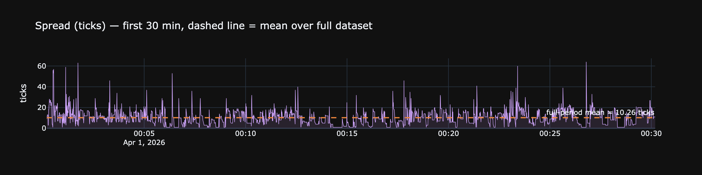

### 2.3 Spread — distribution & autocorrelation

```python
SPREAD_X_MAX = 30   # граница справа на первых двух графиках; увеличь чтобы увидеть хвост

s   = lobs['spread_ticks']
vc  = s.value_counts(normalize=True).sort_index()  # share of time at each spread
acf = [s.autocorr(k) for k in range(1, 51)]
ci  = 1.96 / np.sqrt(len(s))

fig = make_subplots(rows=1, cols=3, subplot_titles=[
  'Distribution (% of time)', 'CDF', 'Autocorrelation (lags 1–50)'])

fig.add_trace(go.Bar(x=vc.index, y=vc.values*100, marker_color='#d2a8ff'), 1, 1)
fig.add_trace(go.Scatter(x=vc.index, y=vc.cumsum().values*100, mode='lines',
                       line=dict(color='#51cf66')), 1, 2)
fig.add_trace(go.Bar(x=list(range(1, 51)), y=acf, marker_color='#d2a8ff'), 1, 3)
fig.add_hline(y= ci, line_dash='dot', line_color='gray', row=1, col=3)
fig.add_hline(y=-ci, line_dash='dot', line_color='gray', row=1, col=3)

fig.update_xaxes(title_text='ticks', range=[0, SPREAD_X_MAX], row=1, col=1)
fig.update_xaxes(title_text='ticks', range=[0, SPREAD_X_MAX], row=1, col=2)
fig.update_xaxes(title_text='lag',   row=1, col=3)
fig.update_layout(template=THEME, height=350, showlegend=False)
show(fig)
```

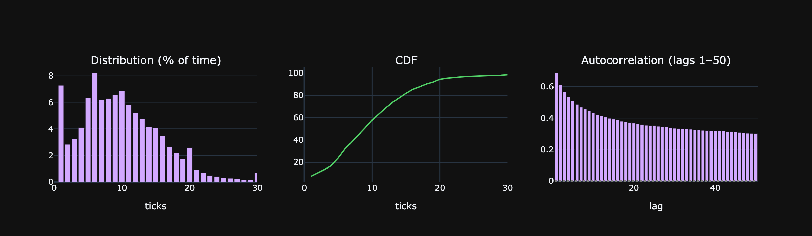

### 2.4 Spread statistics

```python
s     = lobs['spread_ticks']
s_bps = lobs['spread_bps']

stats = pd.DataFrame({'value': [
  f'{s.mean():.3f} ticks    ({s_bps.mean():.3f} bps)',
  f'{s.std():.3f} ticks',
  f'{s.median():.0f}  /  {s.quantile(0.75):.0f}  /  {s.quantile(0.90):.0f}  /  '
      f'{s.quantile(0.95):.0f}  /  {s.quantile(0.99):.0f}  /  {s.quantile(0.999):.0f}',
  f'{s.max()} ticks    ({s_bps.max():.1f} bps)',
  f'{s.skew():+.2f}',
  f'{s.kurtosis():+.2f}',
  f'{(s == 1).mean() * 100:.2f} %',
  f'{(s == 2).mean() * 100:.2f} %',
  f'{(s >= 5).mean()  * 100:.3f} %',
  f'{(s >= 10).mean() * 100:.4f} %',
  f'{(s >= 50).mean() * 100:.4f} %',
  f'{s.autocorr(1):+.3f}',
]}, index=[
  'Mean spread',
  'Std',
  'p50 / p75 / p90 / p95 / p99 / p99.9 (ticks)',
  'Max',
  'Skewness',
  'Excess kurtosis',
  '= 1 tick (% time)',
  '= 2 ticks',
  '≥ 5 ticks',
  '≥ 10 ticks',
  '≥ 50 ticks  (extreme dislocation)',
  'AR(1) of spread_ticks',
])
stats
```

**Result:**
```
                                                                            value
Mean spread                                           10.259 ticks    (1.075 bps)
Std                                                                   6.894 ticks
p50 / p75 / p90 / p95 / p99 / p99.9 (ticks)  9  /  14  /  18  /  21  /  31  /  58
Max                                                       424 ticks    (42.5 bps)
Skewness                                                                    +2.74
Excess kurtosis                                                            +49.08
= 1 tick (% time)                                                          7.28 %
= 2 ticks                                                                  2.84 %
≥ 5 ticks                                                                82.539 %
≥ 10 ticks                                                              49.0318 %
≥ 50 ticks  (extreme dislocation)                                        0.1827 %
AR(1) of spread_ticks                                                      +0.685
```

### 2.5 Returns — 1-second mid

```python
# Snapshot-to-snapshot returns; skip stale rows where mid didn't change
mid_seq  = lobs.sort_values('ts').set_index('ts')['mid']
ret_raw  = mid_seq.pct_change().dropna() * 1e4   # all intervals incl. stale
ret      = ret_raw[ret_raw != 0]                  # actual price moves only

zero_pct = (ret_raw == 0).mean() * 100
print(f'Stale (Δmid=0): {zero_pct:.1f}%  |  '
      f'Actual moves: {len(ret):,}  std={ret.std():.3f} bps  kurt={ret.kurtosis():.1f}')

X_CAP = 5   # bps
x_g   = np.linspace(-X_CAP, X_CAP, 500)

fig = make_subplots(rows=1, cols=2,
    subplot_titles=['Linear scale (central mass)', 'Log-Y scale (fat tails)'])

for col, use_log in [(1, False), (2, True)]:
    fig.add_trace(go.Histogram(
        x=ret.clip(-X_CAP, X_CAP), nbinsx=150, histnorm='probability density',
        name='Empirical', marker_color='#d2a8ff', opacity=0.75,
        showlegend=(col == 1)), row=1, col=col)
    fig.add_trace(go.Scatter(
        x=x_g, y=sps.norm.pdf(x_g, 0, ret.std()),
        mode='lines', name=f'Normal(σ={ret.std():.3f})',
        line=dict(color='#f0883e', width=2),
        showlegend=(col == 1)), row=1, col=col)
    if use_log:
        fig.update_yaxes(type='log', row=1, col=col)

fig.update_xaxes(title_text='Return (bps)')
fig.update_layout(
    template=THEME, height=360, barmode='overlay',
    title=f'Mid-price returns — actual moves only ({zero_pct:.1f}% stale removed)  |  clipped ±{X_CAP} bps')
show(fig)
```

**Output:**
```
Stale (Δmid=0): 67.2%  |  Actual moves: 255,389  std=0.849 bps  kurt=109.8
```

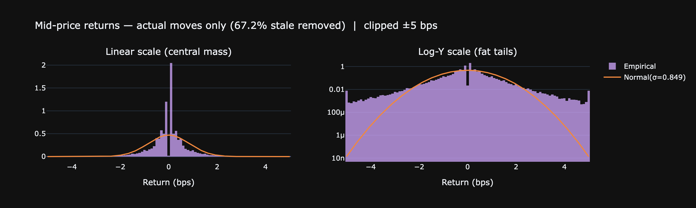

```python
# Absolute mid moves in ticks (same non-zero filter as above)
delta_raw   = lobs.sort_values('ts').set_index('ts')['mid'].diff().dropna()
delta_ticks = (delta_raw / TICK).round().astype(int)
delta_ticks = delta_ticks[delta_ticks != 0]

T_CAP = int(np.percentile(delta_ticks.abs(), 99))   # clip at p99 for readability
print(f'p50={delta_ticks.abs().median():.0f} ticks  '
      f'p95={np.percentile(delta_ticks.abs(), 95):.0f}  '
      f'p99={T_CAP:.0f}  max={delta_ticks.abs().max():.0f}')

x_g_t = np.linspace(-T_CAP, T_CAP, 500)
sigma_t = delta_ticks.std()

fig = make_subplots(rows=1, cols=2,
    subplot_titles=['Linear scale', 'Log-Y scale (fat tails)'])

for col, use_log in [(1, False), (2, True)]:
    fig.add_trace(go.Histogram(
        x=delta_ticks.clip(-T_CAP, T_CAP), nbinsx=min(2*T_CAP, 200),
        histnorm='probability density',
        name='Empirical', marker_color='#79c0ff', opacity=0.75,
        showlegend=(col == 1)), row=1, col=col)
    fig.add_trace(go.Scatter(
        x=x_g_t, y=sps.norm.pdf(x_g_t, 0, sigma_t),
        mode='lines', name=f'Normal(σ={sigma_t:.1f} ticks)',
        line=dict(color='#f0883e', width=2),
        showlegend=(col == 1)), row=1, col=col)
    if use_log:
        fig.update_yaxes(type='log', row=1, col=col)

fig.update_xaxes(title_text='Move (ticks, 1 tick = $0.001)')
fig.update_layout(
    template=THEME, height=360, barmode='overlay',
    title=f'Mid-price moves in ticks  (clipped at p99 = ±{T_CAP} ticks)')
show(fig)
```

**Output:**
```
p50=3 ticks  p95=17  p99=29  max=437
```

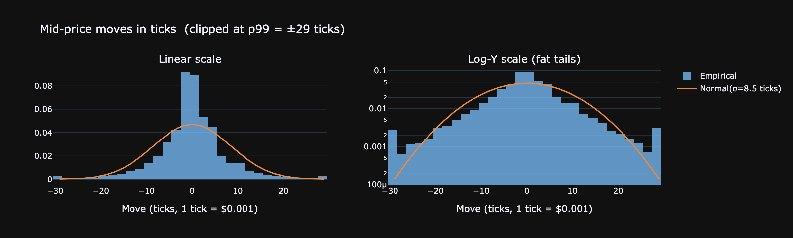

**Что показывают следующие два графика:**

- **QQ-plot** сравнивает квантили реальных возвратов с нормальным распределением: если бы цена была чистым гауссовым броуновским движением — точки лежали бы точно на диагонали. S-образное отклонение = тяжёлые хвосты (fat tails): экстремальные движения случаются намного чаще, чем предсказывает нормаль.
- **ACF(r) ≈ 0** — нет автокорреляции в самих возвратах: прошлое направление не предсказывает следующее (mid ≈ random walk на 1s-горизонте).
- **ACF(r²) значим** — кластеризация волатильности (ARCH-эффект): после крупного движения вероятность ещё одного крупного движения повышена. Для AS это означает, что статический параметр σ надо заменить на скользящий (exponentially-weighted), иначе стратегия будет котировать слишком узко в периоды высокой волатильности.

```python
# ret is computed above (non-zero snapshot-to-snapshot moves)

jb_stat, jb_p = sps.jarque_bera(ret)
print(f'1s returns: N={len(ret):,}  mean={ret.mean():+.3f} bps  std={ret.std():.3f} bps  '
      f'skew={ret.skew():+.2f}  kurt={ret.kurtosis():+.2f}  Jarque–Bera p={jb_p:.2e}')

# QQ-plot via quantile-based downsample (5k pts keeps plotly responsive)
N      = min(len(ret), 5000)
probs  = np.linspace(0.5/N, 1 - 0.5/N, N)
qq_y   = np.quantile(ret, probs)
qq_x   = sps.norm.ppf(probs) * ret.std() + ret.mean()

acf_r  = [ret.autocorr(k)        for k in range(1, 31)]
acf_r2 = [(ret**2).autocorr(k)   for k in range(1, 31)]
ci     = 1.96 / np.sqrt(len(ret))

fig = make_subplots(rows=1, cols=2, subplot_titles=[
    'QQ-plot vs Normal (in bps)', 'ACF: returns (purple) vs squared returns (orange)'])

fig.add_trace(go.Scatter(x=qq_x, y=qq_y, mode='markers',
                         marker=dict(color='#d2a8ff', size=3)), 1, 1)
lo, hi = qq_x.min(), qq_x.max()
fig.add_trace(go.Scatter(x=[lo, hi], y=[lo, hi], mode='lines',
                         line=dict(color='gray', dash='dash')), 1, 1)
fig.add_trace(go.Bar(x=list(range(1,31)), y=acf_r,  marker_color='#d2a8ff', name='r'),    1, 2)
fig.add_trace(go.Bar(x=list(range(1,31)), y=acf_r2, marker_color='#f0883e', name='r²',
                     opacity=0.6), 1, 2)
fig.add_hline(y= ci, line_dash='dot', line_color='gray', row=1, col=2)
fig.add_hline(y=-ci, line_dash='dot', line_color='gray', row=1, col=2)

fig.update_layout(template=THEME, height=350, showlegend=True)
show(fig)
```

**Output:**
```
1s returns: N=255,389  mean=-0.002 bps  std=0.849 bps  skew=+0.79  kurt=+109.79  Jarque–Bera p=0.00e+00
```

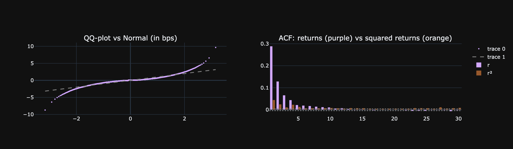

### 2.6 Realized volatility by timescale

Signature plot: σ rescaled to 1-second equivalent (σ_Δt / √Δt).
Flat line = Brownian motion. Down-sloping = mean reversion. Up-sloping = momentum/trending.

```python
scales = [('1s', 1), ('5s', 5), ('15s', 15), ('30s', 30), ('1min', 60), ('5min', 300)]
rows = []
for label, dt in scales:
    m = lobs.set_index('ts')['mid'].resample(label).last().ffill()
    r = m.pct_change().dropna() * 1e4
    rows.append({'scale': label, 'σ per bar (bps)': r.std(),
                 'σ per √sec (bps)': r.std() / np.sqrt(dt)})
sig = pd.DataFrame(rows)

fig = go.Figure()
fig.add_trace(go.Scatter(x=sig['scale'], y=sig['σ per √sec (bps)'],
    mode='lines+markers', line=dict(color='#d2a8ff'), marker=dict(size=10)))
fig.update_layout(template=THEME, height=300,
    title='σ per √second vs sampling scale  —  flat = Brownian',
    yaxis_title='bps / √sec')
show(fig)
sig.round(3)
```

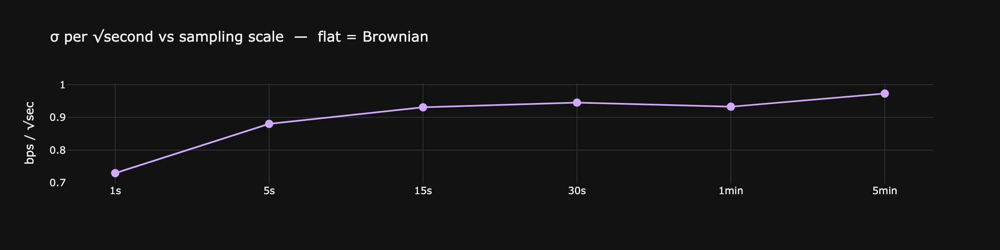

**Result:**
```
  scale  σ per bar (bps)  σ per √sec (bps)
0    1s            0.730             0.730
1    5s            1.968             0.880
2   15s            3.605             0.931
3   30s            5.176             0.945
4  1min            7.223             0.933
5  5min           16.849             0.973
```

## 3. Order book structure

### 3.1 Depth heatmap — first 5 minutes

```python
m5    = lobs[(lobs['ts'] >= T0) & (lobs['ts'] < T0 + pd.Timedelta('5min'))].iloc[::10].reset_index(drop=True)
n_s   = len(m5)
bid_v = np.array([[m5.loc[i, f'bid_sz_{l}'] for l in range(LEVELS)] for i in range(n_s)])
ask_v = np.array([[m5.loc[i, f'ask_sz_{l}'] for l in range(LEVELS)] for i in range(n_s)])
ts_lbl = m5['ts'].dt.strftime('%H:%M:%S').tolist()

# log-scale to compress big parked orders; bids negative on y-axis to mirror book
y_levels = list(range(-LEVELS, 0)) + list(range(1, LEVELS+1))
z        = np.hstack([np.log1p(bid_v[:, ::-1]), np.log1p(ask_v)]).T

fig = go.Figure(go.Heatmap(z=z, x=ts_lbl, y=y_levels, colorscale='Magma',
                           colorbar=dict(title='log(1+vol)')))
fig.update_layout(template=THEME, height=500,
    title='LOB depth (5 min, every 10th snapshot) — y<0: bids, y>0: asks',
    yaxis_title='level (signed)')
show(fig)
```

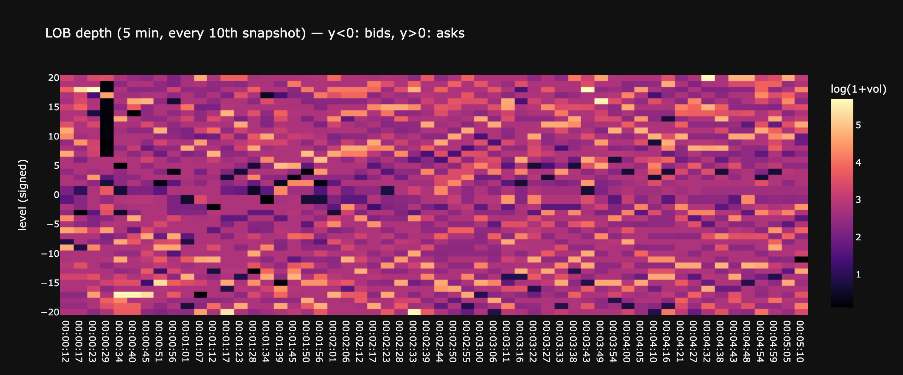

### 3.2 L1 imbalance and microprice

```python
# Correlation: imbalance now → next-snapshot mid change. Computed on full data.
mid_chg = lobs['mid'].diff().shift(-1)
corr    = lobs['imb'].corr(mid_chg)

fig = make_subplots(rows=2, cols=1, shared_xaxes=True,
    subplot_titles=[f'Microprice vs mid (30-min slice)',
                    f'L1 imbalance — corr(imb_t, Δmid_{{t+1}}) = {corr:+.3f} on full data'])

fig.add_trace(go.Scatter(x=lob30['ts'], y=lob30['mid'],        name='mid',
                         line=dict(color='#d2a8ff', width=1.2)), 1, 1)
fig.add_trace(go.Scatter(x=lob30['ts'], y=lob30['microprice'], name='microprice',
                         line=dict(color='#f0883e', width=1.0, dash='dot')), 1, 1)
fig.add_trace(go.Scatter(x=lob30['ts'], y=lob30['imb'], name='imbalance',
                         line=dict(color='#51cf66', width=0.6),
                         fill='tozeroy', fillcolor='rgba(81,207,102,0.10)'), 2, 1)
fig.update_yaxes(range=[-1, 1], row=2, col=1)
fig.update_layout(template=THEME, height=550, showlegend=True)
show(fig)
```

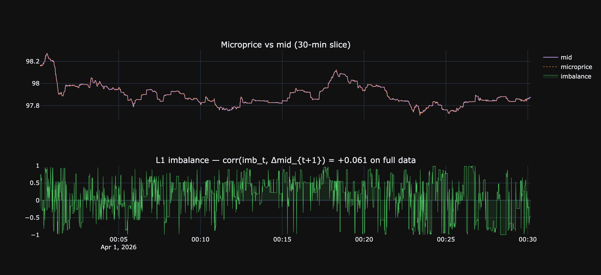

### 3.3 Intraday profile

Activity (trades/min) and mid-volatility (5-min bars), averaged across all loaded days by minute-of-day.
Reveals daily seasonality — typical US/EU session peaks.

```python
n_days = lobs['ts'].dt.date.nunique()

# trades/min per minute-of-day, averaged across days
tx = taker.copy()
tx['mod'] = tx['ts'].dt.hour * 60 + tx['ts'].dt.minute
activity  = tx.groupby('mod').size() / n_days

# σ per 5-min bar, by 5-min bucket of the day
lobs['bucket5'] = ((lobs['ts'].dt.hour*60 + lobs['ts'].dt.minute) // 5) * 5
mid_chg_bps     = lobs['mid'].pct_change() * 1e4
vol_5m          = mid_chg_bps.groupby(lobs['bucket5']).std()

fig = make_subplots(rows=2, cols=1, shared_xaxes=True,
    subplot_titles=['Trades / minute (avg across days)',
                    'σ (bps) by 5-min bucket of day'])
fig.add_trace(go.Bar(x=activity.index, y=activity.values, marker_color='#d2a8ff'), 1, 1)
fig.add_trace(go.Scatter(x=vol_5m.index, y=vol_5m.values, mode='lines',
                         line=dict(color='#f0883e')), 2, 1)
fig.update_xaxes(title_text='minute of day (UTC)', row=2, col=1)
fig.update_layout(template=THEME, height=500, showlegend=False)
show(fig)
```

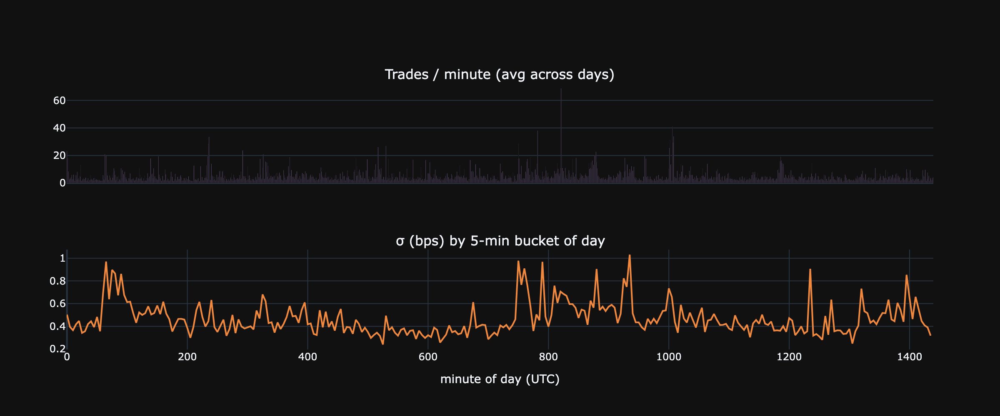

## 4. Trade analysis

### 4.1 Overview

```python
dur_s   = (taker['ts'].max() - taker['ts'].min()).total_seconds()
n_buy   = (taker['agg']=='buy').sum()
n_sell  = (taker['agg']=='sell').sum()
v_buy   = taker.loc[taker['agg']=='buy',  'sz'].sum()
v_sell  = taker.loc[taker['agg']=='sell', 'sz'].sum()

t_overview = pd.DataFrame({'value': [
    f'{len(taker):,}',
    f'{len(taker)/dur_s:.2f} /sec   ({len(taker)/dur_s*60:.0f} /min)',
    f'{n_buy:,}  ({n_buy/len(taker)*100:.1f}%)',
    f'{n_sell:,}  ({n_sell/len(taker)*100:.1f}%)',
    f'{taker["sz"].sum():,.0f} {ASSET_NAME}',
    f'{v_buy:,.0f} {ASSET_NAME}  ({v_buy/(v_buy+v_sell)*100:.1f}%)',
    f'{v_sell:,.0f} {ASSET_NAME}  ({v_sell/(v_buy+v_sell)*100:.1f}%)',
    f'mean {taker["sz"].mean():.2f}   median {taker["sz"].median():.2f}   p99 {taker["sz"].quantile(0.99):.1f}',
]}, index=['Trades', 'Rate', 'Buys', 'Sells', 'Total volume', 'Buy volume', 'Sell volume', 'Trade size ({ASSET_NAME})'])
t_overview
```

**Result:**
```
                                                        value
Trades                                                 35,569
Rate                                     0.08 /sec   (5 /min)
Buys                                          18,428  (51.8%)
Sells                                         17,141  (48.2%)
Total volume                                     215,463 AAVE
Buy volume                              102,866 AAVE  (47.7%)
Sell volume                             112,597 AAVE  (52.3%)
Trade size ({ASSET_NAME})  mean 6.06   median 1.52   p99 63.4
```

### 4.2 Trade size distribution

```python
LIN_BIN = 0.5   # bucket width for linear-scale panel

log_buy  = np.log10(taker.loc[taker['agg']=='buy',  'sz'].clip(lower=0.01))
log_sell = np.log10(taker.loc[taker['agg']=='sell', 'sz'].clip(lower=0.01))
bins     = np.linspace(min(log_buy.min(), log_sell.min()),
                     max(log_buy.max(), log_sell.max()), 60)

bc, _ = np.histogram(log_buy,  bins=bins, density=True)
sc, _ = np.histogram(log_sell, bins=bins, density=True)
xc    = 0.5 * (bins[:-1] + bins[1:])

sz_buy  = taker.loc[taker['agg']=='buy',  'sz']
sz_sell = taker.loc[taker['agg']=='sell', 'sz']
lin_cap = np.percentile(taker['sz'], 80)
lin_bins = np.arange(0, lin_cap + LIN_BIN, LIN_BIN)

bc2, _ = np.histogram(sz_buy.clip(upper=lin_cap),  bins=lin_bins, density=True)
sc2, _ = np.histogram(sz_sell.clip(upper=lin_cap), bins=lin_bins, density=True)
xc2    = 0.5 * (lin_bins[:-1] + lin_bins[1:])

fig = make_subplots(rows=1, cols=2,
  subplot_titles=['Log10 scale', f'Linear scale (bin={LIN_BIN} {ASSET_NAME}, clipped p80={lin_cap:.1f})'])

fig.add_trace(go.Bar(x=xc,  y=bc,  name='buy',  marker_color='#51cf66', opacity=0.6), 1, 1)
fig.add_trace(go.Bar(x=xc,  y=sc,  name='sell', marker_color='#ff6b6b', opacity=0.6), 1, 1)
fig.add_trace(go.Bar(x=xc2, y=bc2, name='buy',  marker_color='#51cf66', opacity=0.6, showlegend=False), 1, 2)
fig.add_trace(go.Bar(x=xc2, y=sc2, name='sell', marker_color='#ff6b6b', opacity=0.6, showlegend=False), 1, 2)

fig.update_xaxes(title_text='log10(size)', row=1, col=1)
fig.update_xaxes(title_text=f'size ({ASSET_NAME})',  row=1, col=2)
fig.update_layout(template=THEME, barmode='overlay', height=380,
  title='Trade size distribution — buy vs sell')
show(fig)
```

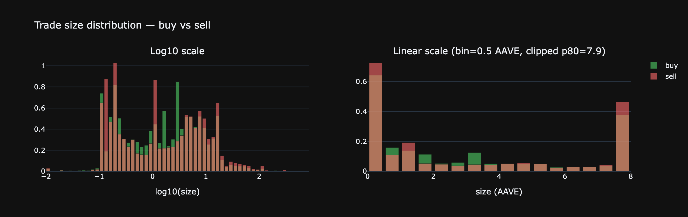

### 4.3 Price impact

For each taker fill: `mid_after − mid_before` in ticks, signed by aggressor direction.
Uses `merge_asof` to find the LOB snapshot just before and just after each trade.

```python
tx = taker.sort_values('ts')[['ts', 'agg', 'sz']].reset_index(drop=True)
lb = lobs.sort_values('ts')[['ts', 'mid']].reset_index(drop=True)

before = pd.merge_asof(tx, lb.rename(columns={'ts':'ts_b','mid':'mid_b'}),
                       left_on='ts', right_on='ts_b', direction='backward')
after  = pd.merge_asof(tx, lb.rename(columns={'ts':'ts_a','mid':'mid_a'}),
                       left_on='ts', right_on='ts_a', direction='forward')

imp = before[['agg','sz']].copy()
imp['mid_b'] = before['mid_b']
imp['mid_a'] = after['mid_a']
imp = imp.dropna()
imp['ticks']        = (imp['mid_a'] - imp['mid_b']) / TICK
imp['signed_ticks'] = np.where(imp['agg']=='buy', imp['ticks'], -imp['ticks'])
imp['log_sz']       = np.log10(imp['sz'].clip(lower=0.01))

# avg signed impact in 8 size buckets
imp['bucket'] = pd.cut(imp['log_sz'], bins=8)
agg = imp.groupby('bucket', observed=True)['signed_ticks'].agg(['mean','std','count'])
agg['x'] = [b.mid for b in agg.index]

fig = make_subplots(rows=1, cols=2, subplot_titles=[
    f'Signed impact (ticks) — mean = {imp["signed_ticks"].mean():+.3f}',
    'Avg signed impact vs trade size'])

clip = imp['signed_ticks'].clip(*np.quantile(imp['signed_ticks'], [0.005, 0.995]))
fig.add_trace(go.Histogram(x=clip, nbinsx=80, marker_color='#d2a8ff'), 1, 1)
fig.add_trace(go.Scatter(x=agg['x'], y=agg['mean'], mode='lines+markers',
                         error_y=dict(array=agg['std']/np.sqrt(agg['count'])),
                         line=dict(color='#f0883e')), 1, 2)
fig.update_xaxes(title_text='ticks',       row=1, col=1)
fig.update_xaxes(title_text='log10(size)', row=1, col=2)
fig.update_layout(template=THEME, height=350, showlegend=False)
show(fig)
```

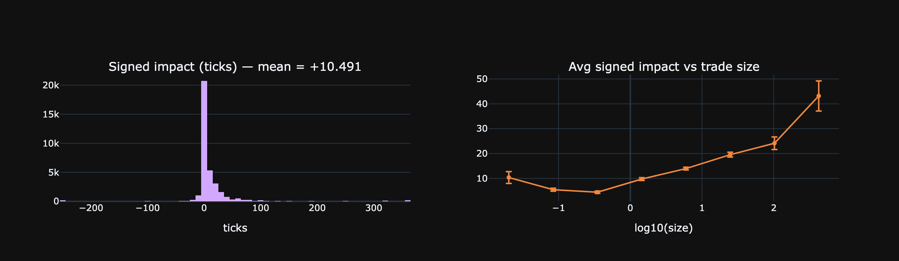

### 4.4 Inter-arrival times — distribution of Δt between consecutive trades

How much time passes between two consecutive taker fills? Three complementary views:
- **Linear PDF (clipped at p99)** — shape of the bulk (where most Δt live).
- **PDF over log₁₀(Δt)** — full range from ms-bursts to second-long gaps; reveals multimodality if the process has distinct regimes (active vs quiet).
- **Survival 1−CDF on log-log** — distribution family test. Exponential (memoryless Poisson) is a straight line on **semi-log y**. A heavier tail (curve up) means long pauses are more frequent than Poisson predicts → activity is bursty/clustered.

```python
ia     = taker['ts'].sort_values().diff().dt.total_seconds().dropna() * 1000  # ms
lam_ms = 1.0 / ia.mean()       # rate in 1/ms
lam_s  = lam_ms * 1000          # rate per second (≈ trades/sec)

# Rich percentile table — focuses purely on the Δt distribution
stats_44 = pd.DataFrame({'value': [
    f'{len(ia):,}',
    f'{ia.mean():.1f} ms      (λ̂ = {lam_s:.2f} trades/sec)',
    f'{ia.std():.1f} ms',
    f'{ia.quantile(0.10):.1f} ms',
    f'{ia.quantile(0.50):.1f} ms',
    f'{ia.quantile(0.90):.0f} ms',
    f'{ia.quantile(0.99):.0f} ms',
    f'{ia.quantile(0.999):.0f} ms  ({ia.quantile(0.999)/1000:.2f} s)',
    f'{ia.max():.0f} ms  ({ia.max()/1000:.1f} s)',
    f'{(ia < 50).mean()*100:.2f} %',
    f'{(ia > 1000).mean()*100:.2f} %',
    f'{(ia > 10000).mean()*100:.4f} %',
]}, index=[
    'Count', 'Mean Δt', 'Std',
    'p10', 'p50 (median)', 'p90', 'p99', 'p99.9', 'Max',
    'Δt < 50 ms (back-to-back bursts)',
    'Δt > 1 sec  (notable gaps)',
    'Δt > 10 sec (rare lulls)',
])
print(stats_44.to_string())

# Panel 1: linear PDF clipped at p99 — bulk shape
p99       = ia.quantile(0.99)
clip      = ia.clip(upper=p99)
c1, e1    = np.histogram(clip, bins=80, density=True)
x1        = 0.5 * (e1[:-1] + e1[1:])
x_exp     = np.linspace(0, p99, 200)
y_exp     = lam_ms * np.exp(-lam_ms * x_exp)

# Panel 2: PDF over log10(Δt) — full range across magnitudes
log_ia    = np.log10(ia.clip(lower=1))   # clip to ≥1 ms to avoid log(0)
c2, e2    = np.histogram(log_ia, bins=60, density=True)
x2        = 0.5 * (e2[:-1] + e2[1:])

# Panel 3: survival 1-CDF on log-log — distribution-family test
sorted_ia = np.sort(ia.values)
surv      = 1 - np.arange(1, len(sorted_ia) + 1) / len(sorted_ia)
idx       = np.linspace(0, len(sorted_ia) - 2, 1000).astype(int)
sx, sy    = sorted_ia[idx], surv[idx]
sy_exp    = np.exp(-lam_ms * sx)

fig = make_subplots(rows=1, cols=3, subplot_titles=[
    f'Linear PDF  (clipped at p99 = {p99:.0f} ms)',
    'PDF on log₁₀(Δt) — full range',
    'Survival 1−CDF (log-log) — straight on semi-log = exponential',
])
fig.add_trace(go.Bar(x=x1, y=c1, name='empirical', marker_color='#d2a8ff'), 1, 1)
fig.add_trace(go.Scatter(x=x_exp, y=y_exp, name=f'Exp(λ̂)',
                         line=dict(color='#f0883e')), 1, 1)
fig.add_trace(go.Bar(x=x2, y=c2, marker_color='#d2a8ff', showlegend=False), 1, 2)
fig.add_trace(go.Scatter(x=sx, y=sy, line=dict(color='#d2a8ff'),
                         name='empirical', showlegend=False), 1, 3)
fig.add_trace(go.Scatter(x=sx, y=sy_exp, line=dict(color='#f0883e', dash='dot'),
                         name='Exp ref', showlegend=False), 1, 3)

fig.update_xaxes(title_text='Δt (ms)',         row=1, col=1)
fig.update_xaxes(title_text='log₁₀(Δt, ms)',   row=1, col=2)
fig.update_xaxes(title_text='Δt (ms)', type='log', row=1, col=3)
fig.update_yaxes(type='log', row=1, col=3)
fig.update_layout(template=THEME, height=380, showlegend=True)
show(fig)
```

**Output:**
```
                                                                   value
Count                                                             35,568
Mean Δt                           12145.0 ms      (λ̂ = 0.08 trades/sec)
Std                                                           20286.5 ms
p10                                                               0.0 ms
p50 (median)                                                   1968.5 ms
p90                                                             40365 ms
p99                                                             85651 ms
p99.9                                              125504 ms  (125.50 s)
Max                                                 237357 ms  (237.4 s)
Δt < 50 ms (back-to-back bursts)                                 35.65 %
Δt > 1 sec  (notable gaps)                                       54.37 %
Δt > 10 sec (rare lulls)                                       30.4459 %
```

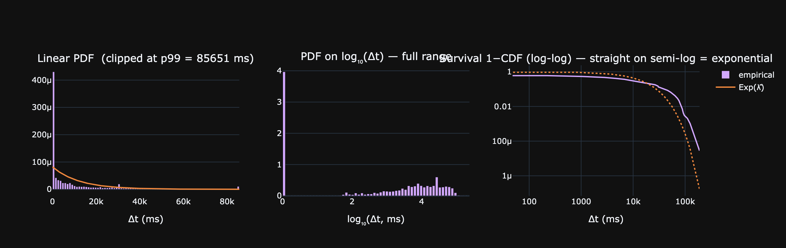

### 4.5 Zoom: 0–500 ms

Большая часть массы Δt сидит в самой левой коробке предыдущего графика. Здесь видно тонкую структуру — пики на конкретных задержках, refractory-эффект сразу после трейда, реальную форму распадающегося пика.

```python
# Multi-leg market orders дают N taker-строк с одним time_ms → Δt = 0 между ними.
# Свёртываем по time_ms: одно событие = один матчинг-момент (независимо от числа legs).
events_ts = taker['ts'].drop_duplicates().sort_values()
ia2       = events_ts.diff().dt.total_seconds().dropna() * 1000  # ms

print(f'Taker legs: {len(taker):,}   →   unique events (by time_ms): {len(events_ts):,}'
      f'   ({len(events_ts)/len(taker)*100:.1f}% — остальное — legs внутри одного MO)')

lam_ms2 = 1.0 / ia2.mean()
lam_s2  = lam_ms2 * 1000

ZOOM_MAX = 500   # ms
BIN      = 1     # ms

bins      = np.arange(0, ZOOM_MAX + BIN, BIN)
ia_zoom   = ia2[ia2 <= ZOOM_MAX]
counts, _ = np.histogram(ia_zoom, bins=bins, density=True)
centers   = 0.5 * (bins[:-1] + bins[1:])

y_exp = lam_ms2 * np.exp(-lam_ms2 * centers)

share_in_zoom = (ia2 <= ZOOM_MAX).mean() * 100
print(f'{share_in_zoom:.2f}% of event Δt fall into [0, {ZOOM_MAX}] ms  '
      f'(N = {len(ia_zoom):,})  λ̂_events = {lam_s2:.2f}/sec')

fig = go.Figure()
fig.add_trace(go.Bar(x=centers, y=counts, marker_color='#d2a8ff',
                     name=f'empirical ({BIN} ms bins)'))
fig.add_trace(go.Scatter(x=centers, y=y_exp, line=dict(color='#f0883e'),
                         name=f'Exp(λ̂={lam_s2:.1f}/s)'))
fig.update_layout(template=THEME, height=400,
    title=f'Inter-event Δt PDF (deduped by time_ms), 0–{ZOOM_MAX} ms, {BIN} ms bins',
    xaxis_title='Δt (ms)', yaxis_title='density')
show(fig)
```

**Output:**
```
Taker legs: 35,569   →   unique events (by time_ms): 22,924   (64.4% — остальное — legs внутри одного MO)
10.09% of event Δt fall into [0, 500] ms  (N = 2,314)  λ̂_events = 0.05/sec
```

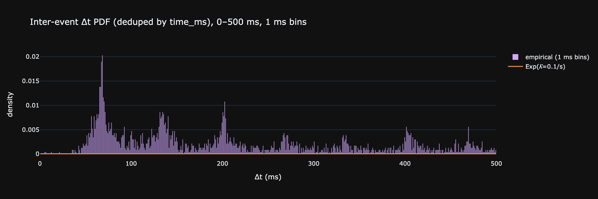

## 5. Data quality

### 5.1 LOB snapshot cadence

С какой частотой биржа отдаёт snapshot стакана? Есть ли длинные «слепые» паузы?

```python
dt = lobs['time_ms'].diff().dropna()

stats = pd.DataFrame({'value': [
    f'{dt.median():.0f} ms',
    f'{dt.mean():.0f} ms',
    f'{dt.quantile(0.90):.0f} ms',
    f'{dt.quantile(0.99):.0f} ms',
    f'{dt.max():.0f} ms  ({dt.max()/1000:.1f} s)',
    f'{(dt > 1000).mean()*100:.3f} %',
    f'{(dt > 10000).mean()*100:.4f} %',
]}, index=['Median Δt', 'Mean Δt', 'p90', 'p99', 'Max gap',
          'Δt > 1 sec', 'Δt > 10 sec'])
print(stats.to_string())

clip          = dt.clip(upper=dt.quantile(0.999))
counts, edges = np.histogram(clip, bins=80, density=True)
centers       = 0.5 * (edges[:-1] + edges[1:])

sorted_dt = np.sort(dt.values)
surv      = 1 - np.arange(1, len(sorted_dt)+1) / len(sorted_dt)
idx       = np.linspace(0, len(sorted_dt)-2, 1000).astype(int)

fig = make_subplots(rows=1, cols=2, subplot_titles=[
    'Snapshot Δt PDF (clipped at p99.9)',
    'Survival 1−CDF (log-y)'])
fig.add_trace(go.Bar(x=centers, y=counts, marker_color='#d2a8ff'), 1, 1)
fig.add_trace(go.Scatter(x=sorted_dt[idx], y=surv[idx],
                         line=dict(color='#d2a8ff')), 1, 2)
fig.update_xaxes(title_text='Δt (ms)', row=1, col=1)
fig.update_xaxes(title_text='Δt (ms)', row=1, col=2)
fig.update_yaxes(type='log', row=1, col=2)
fig.update_layout(template=THEME, height=350, showlegend=False)
show(fig)
```

**Output:**
```
                            value
Median Δt                  537 ms
Mean Δt                    555 ms
p90                        574 ms
p99                        620 ms
Max gap      404902 ms  (404.9 s)
Δt > 1 sec                0.018 %
Δt > 10 sec              0.0104 %
```

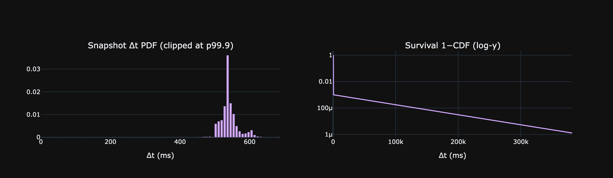

### 5.2 Trade-to-snapshot lag

Для каждого трейда — расстояние до **ближайшего** LOB-снапшота (вперёд или назад). Это floor на точность реконструкции состояния книги в момент трейда.

```python
tx = taker[['ts']].sort_values('ts').reset_index(drop=True)
lb = lobs[['ts']].sort_values('ts').reset_index(drop=True)

before   = pd.merge_asof(tx, lb.rename(columns={'ts':'ts_b'}),
                         left_on='ts', right_on='ts_b', direction='backward')
after    = pd.merge_asof(tx, lb.rename(columns={'ts':'ts_a'}),
                         left_on='ts', right_on='ts_a', direction='forward')
lag_back = (tx['ts'] - before['ts_b']).dt.total_seconds() * 1000
lag_fwd  = (after['ts_a'] - tx['ts']).dt.total_seconds() * 1000
lag_min  = pd.concat([lag_back, lag_fwd], axis=1).min(axis=1).dropna()

stats = pd.DataFrame({'value': [
    f'{lag_min.median():.0f} ms',
    f'{lag_min.mean():.0f} ms',
    f'{lag_min.quantile(0.90):.0f} ms',
    f'{lag_min.quantile(0.99):.0f} ms',
    f'{lag_min.max():.0f} ms',
]}, index=['Median', 'Mean', 'p90', 'p99', 'Max'])
print(stats.to_string())

clip          = lag_min.clip(upper=lag_min.quantile(0.97))
counts, edges = np.histogram(clip, bins=80, density=True)
centers       = 0.5 * (edges[:-1] + edges[1:])

fig = go.Figure()
fig.add_trace(go.Bar(x=centers, y=counts, marker_color='#d2a8ff', name='lag'))
fig.update_layout(template=THEME, height=320,
    title=f'Trade → nearest snapshot (clipped at p97 = {lag_min.quantile(0.97):.0f} ms)',
    xaxis_title='ms', yaxis_title='density')
show(fig)
```

**Output:**
```
            value
Median     134 ms
Mean      2758 ms
p90        257 ms
p99     117442 ms
Max     200393 ms
```

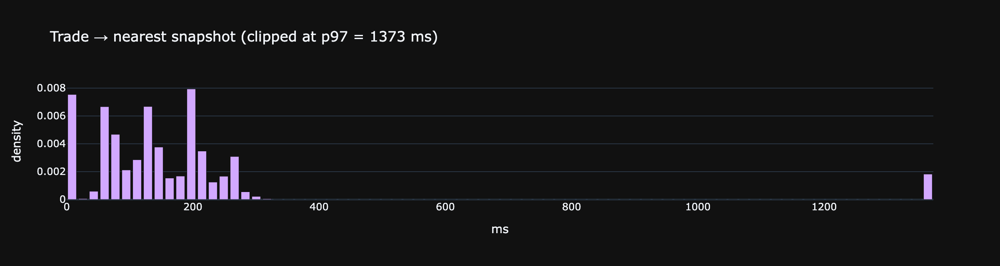

## 6. Order book microstructure

### 6.1 Aggregate depth profile

Усреднённые `sz` (объём в SYMBOL) и `n` (число ордеров) по каждому из 20 уровней. Где сидит реальная масса ликвидности — у L1 или в глубине?

```python
levels = list(range(LEVELS))
prof   = pd.DataFrame({
    'level':  levels,
    'bid_sz': [lobs[f'bid_sz_{i}'].mean() for i in levels],
    'ask_sz': [lobs[f'ask_sz_{i}'].mean() for i in levels],
    'bid_n':  [lobs[f'bid_n_{i}'].mean()  for i in levels],
    'ask_n':  [lobs[f'ask_n_{i}'].mean()  for i in levels],
})
prof['avg_order_bid'] = prof['bid_sz'] / prof['bid_n']
prof['avg_order_ask'] = prof['ask_sz'] / prof['ask_n']

fig = make_subplots(rows=2, cols=1, shared_xaxes=True, row_heights=[0.5, 0.5],
    subplot_titles=[f'Avg size per level ({ASSET_NAME}) — bids vs asks',
                    'Avg # of orders per level'])
fig.add_trace(go.Bar(x=prof['level'], y=-prof['bid_sz'], name='bid sz',
                    marker_color='#51cf66'), 1, 1)
fig.add_trace(go.Bar(x=prof['level'], y= prof['ask_sz'], name='ask sz',
                    marker_color='#ff6b6b'), 1, 1)
fig.add_trace(go.Bar(x=prof['level'], y=-prof['bid_n'], name='bid n',
                    marker_color='#51cf66', showlegend=False), 2, 1)
fig.add_trace(go.Bar(x=prof['level'], y= prof['ask_n'], name='ask n',
                    marker_color='#ff6b6b', showlegend=False), 2, 1)
fig.update_xaxes(title_text='level (0 = best)', row=2, col=1)
fig.update_layout(template=THEME, height=550, showlegend=True)
show(fig)

prof.round(2)
```

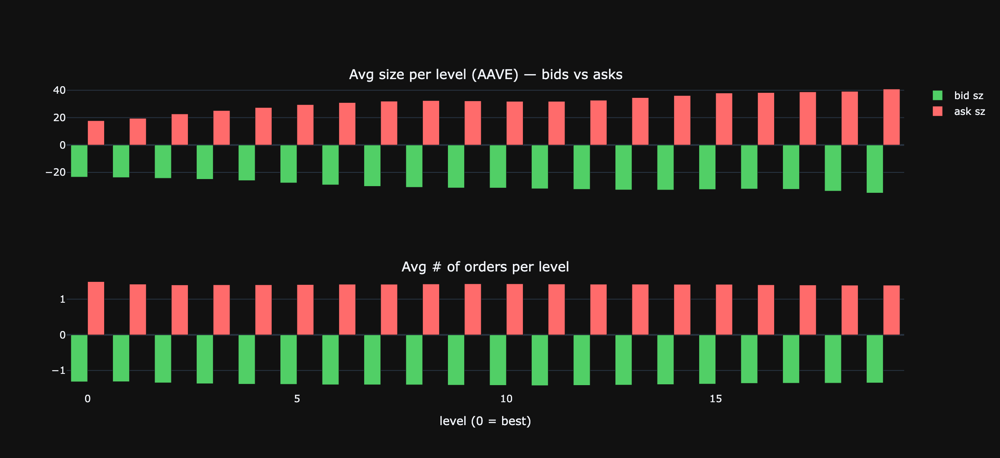

**Result:**
```
    level  bid_sz  ask_sz  bid_n  ask_n  avg_order_bid  avg_order_ask
0       0   23.45   17.76   1.32   1.49          17.81          11.90
1       1   23.79   19.50   1.31   1.42          18.10          13.71
2       2   24.32   22.68   1.35   1.40          18.08          16.19
3       3   25.06   25.15   1.37   1.40          18.28          17.92
4       4   26.04   27.40   1.38   1.40          18.81          19.52
5       5   27.70   29.52   1.39   1.41          19.96          20.94
6       6   29.16   31.01   1.40   1.42          20.83          21.87
7       7   30.24   32.01   1.40   1.42          21.59          22.58
8       8   30.94   32.44   1.40   1.43          22.07          22.74
9       9   31.37   32.25   1.41   1.43          22.23          22.53
10     10   31.41   31.91   1.42   1.43          22.18          22.30
11     11   31.97   31.90   1.42   1.43          22.45          22.38
12     12   32.45   32.68   1.42   1.42          22.89          23.03
13     13   32.83   34.62   1.41   1.42          23.29          24.38
14     14   32.88   36.15   1.39   1.42          23.58          25.52
15     15   32.52   37.97   1.38   1.42          23.57          26.80
16     16   32.16   38.31   1.36   1.40          23.61          27.29
17     17   32.33   38.81   1.36   1.40          23.85          27.78
18     18   33.71   39.22   1.35   1.39          24.89          28.18
19     19   35.12   40.90   1.35   1.39          26.04          29.38
```

### 6.2 Queue length at L1

Сколько ордеров стоит на лучшем уровне и какого они размера. `n` уникален для HL — на CEX feed обычно не доступен.

```python
n1     = lobs['bid_n_0'].combine(lobs['ask_n_0'], func=max)  # take both sides
n_bid  = lobs['bid_n_0']
n_ask  = lobs['ask_n_0']
sz_per_order_bid = lobs['bid_sz_0'] / lobs['bid_n_0']
sz_per_order_ask = lobs['ask_sz_0'] / lobs['ask_n_0']

stats = pd.DataFrame({
    'bid L1': [n_bid.median(), n_bid.mean(), n_bid.quantile(0.99), n_bid.max(),
               sz_per_order_bid.median()],
    'ask L1': [n_ask.median(), n_ask.mean(), n_ask.quantile(0.99), n_ask.max(),
               sz_per_order_ask.median()],
}, index=['median # orders', 'mean # orders', 'p99 # orders', 'max # orders',
         f'median order sz ({ASSET_NAME})']).round(2)
print(stats.to_string())

# Joint distribution of bid_n_0 (capped for plotting)
n_cap = 30
bid_hist = n_bid.clip(upper=n_cap).value_counts(normalize=True).sort_index()
ask_hist = n_ask.clip(upper=n_cap).value_counts(normalize=True).sort_index()

fig = go.Figure()
fig.add_trace(go.Bar(x=bid_hist.index, y=bid_hist.values*100, name='bid L1',
                    marker_color='#51cf66', opacity=0.6))
fig.add_trace(go.Bar(x=ask_hist.index, y=ask_hist.values*100, name='ask L1',
                    marker_color='#ff6b6b', opacity=0.6))
fig.update_layout(template=THEME, barmode='overlay', height=320,
    title=f'Distribution of # orders at L1 (capped at {n_cap})',
    xaxis_title='# orders', yaxis_title='% of snapshots')
show(fig)
```

**Output:**
```
                        bid L1  ask L1
median # orders           1.00    1.00
mean # orders             1.32    1.49
p99 # orders              4.00    5.00
max # orders             19.00   32.00
median order sz (AAVE)   10.09    9.30
```

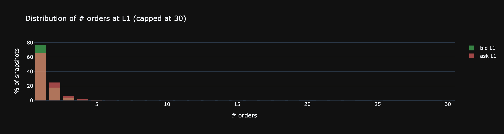

### 6.3 Top-of-book churn

Как часто меняется лучшая цена? Распределение времени жизни L1.

```python
bid_changed = lobs['bid_px_0'].diff() != 0
ask_changed = lobs['ask_px_0'].diff() != 0
either      = bid_changed | ask_changed

print(f'% snapshots where best bid changed: {bid_changed.mean()*100:.2f}%')
print(f'% snapshots where best ask changed: {ask_changed.mean()*100:.2f}%')
print(f'% snapshots where either changed:   {either.mean()*100:.2f}%')

# Lifetime of best bid: ms between consecutive changes
bid_runs    = bid_changed.cumsum()
bid_runtime = lobs.groupby(bid_runs)['time_ms'].agg(['first','last'])
bid_life_ms = (bid_runtime['last'] - bid_runtime['first']).iloc[1:]   # drop initial run

ask_runs    = ask_changed.cumsum()
ask_runtime = lobs.groupby(ask_runs)['time_ms'].agg(['first','last'])
ask_life_ms = (ask_runtime['last'] - ask_runtime['first']).iloc[1:]

life = pd.concat([bid_life_ms, ask_life_ms])

stats = pd.DataFrame({'value': [
    f'{life.median():.0f} ms',
    f'{life.mean():.0f} ms',
    f'{life.quantile(0.90):.0f} ms',
    f'{life.quantile(0.99):.0f} ms',
    f'{life.max()/1000:.1f} s',
]}, index=['Median lifetime', 'Mean', 'p90', 'p99', 'Max'])
print()
stats
```

**Output:**
```
% snapshots where best bid changed: 24.81%
% snapshots where best ask changed: 21.05%
% snapshots where either changed:   33.08%
```

**Result:**
```
                    value
Median lifetime      0 ms
Mean              1818 ms
p90               4854 ms
p99              22534 ms
Max               279.8 s
```

```python
BIN_MS = 10   # ms per bucket

p95   = life.quantile(0.90)
edges = np.arange(0, p95 + BIN_MS, BIN_MS)
clip  = life.clip(upper=p95)

counts, edges = np.histogram(clip, bins=edges, density=True)
centers       = 0.5 * (edges[:-1] + edges[1:])

fig = go.Figure()
fig.add_trace(go.Bar(x=centers, y=counts, marker_color='#d2a8ff', width=BIN_MS * 0.9))
fig.update_layout(template=THEME, height=320,
  title=f'Lifetime of best bid/ask  (bin={BIN_MS} ms, clipped p95 = {p95:.0f} ms)',
  xaxis_title='ms', yaxis_title='density')
show(fig)
```

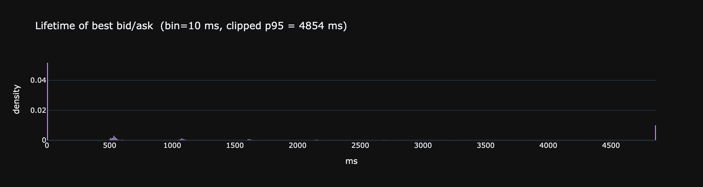

### 6.4 Where trades happen relative to mid

Для каждого трейда — на каком расстоянии от mid он случился. По сути descriptive λ(δ): сколько массы трейдов сидит на L1 и сколько уходит вглубь книги.

```python
tx = taker[['ts','agg','sz','px']].sort_values('ts').reset_index(drop=True)
lb = lobs[['ts','mid','bid_px_0','ask_px_0']].sort_values('ts').reset_index(drop=True)
m  = pd.merge_asof(tx, lb, on='ts', direction='backward').dropna()

# Depth into book = how far past best touch did the aggressor reach (in ticks).
# 0 = filled at L1, 1+ = walked through book.
m['depth_ticks'] = np.where(
    m['agg']=='buy',
    (m['px'] - m['ask_px_0']) / TICK,
    (m['bid_px_0'] - m['px']) / TICK,
).round(0).astype(int)

# Stats
share = m.groupby('depth_ticks').size() / len(m) * 100

cap = 20
hist = m['depth_ticks'].clip(lower=-cap, upper=cap).value_counts(normalize=True).sort_index()

fig = go.Figure()
fig.add_trace(go.Bar(x=hist.index, y=hist.values*100, marker_color='#d2a8ff'))
fig.update_layout(template=THEME, height=320,
    title=f'Trade depth past L1 (ticks, capped at {cap})',
    xaxis_title='ticks past L1 (0 = fill at touch)',
    yaxis_title='% of trades')
show(fig)
```

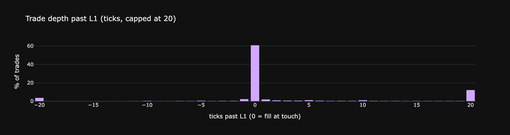

## 7. Price dynamics over short horizons

### 7.1 Mid drift at multiple horizons

Распределение `log(mid(t+Δt) / mid(t))` в bps для нескольких Δt. Брауновское движение → std∝√Δt. Если на коротких Δt дисперсия меньше предсказанной — есть mean-reversion.

```python
mid_grid = lobs.set_index('ts')['mid'].resample('1s').last().ffill()
horizons = [(1,'1s'), (5,'5s'), (15,'15s'), (60,'1min'), (300,'5min')]

rows = []
drifts_bps   = {}
drifts_ticks = {}
for k, label in horizons:
    bps   = (np.log(mid_grid.shift(-k)) - np.log(mid_grid)).dropna() * 1e4
    ticks = (mid_grid.shift(-k) - mid_grid).dropna() / TICK
    drifts_bps[label]   = bps
    drifts_ticks[label] = ticks
    rows.append({'horizon': label, 'σ bps': round(bps.std(), 3),
                 'σ ticks': round(ticks.std(), 1),
                 'p99 bps': round(bps.quantile(0.99), 2),
                 'p99 ticks': round(ticks.quantile(0.99), 1)})
pd.DataFrame(rows)
```

**Result:**
```
  horizon   σ bps  σ ticks  p99 bps  p99 ticks
0      1s   0.730      7.0     2.31       22.0
1      5s   1.962     18.8     5.76       55.0
2     15s   3.623     34.7    10.14       97.5
3    1min   7.341     70.3    19.88      190.5
4    5min  16.763    160.4    46.63      450.5
```

```python
colors = ['#d2a8ff', '#51cf66', '#f0883e', '#ff6b6b', '#7ab8ff']
fig = make_subplots(rows=2, cols=len(horizons),
    subplot_titles=(
        [f'{lbl}  σ={drifts_bps[lbl].std():.2f} bps'   for _, lbl in horizons] +
        [f'{lbl}  σ={drifts_ticks[lbl].std():.1f} ticks' for _, lbl in horizons]
    ))

for col, ((k, label), color) in enumerate(zip(horizons, colors), start=1):
    for row, (drifts, unit, bins) in enumerate([
        (drifts_bps,   'bps',   80),
        (drifts_ticks, 'ticks', 80),
    ], start=1):
        d   = drifts[label]
        lim = d.abs().quantile(0.99) * 1.2
        c, e = np.histogram(d.clip(-lim, lim), bins=bins, density=True)
        xc   = 0.5 * (e[:-1] + e[1:])
        fig.add_trace(go.Scatter(x=xc, y=c, mode='lines',
            line=dict(color=color, width=1.5), showlegend=False), row=row, col=col)
        xg = np.linspace(-lim, lim, 300)
        fig.add_trace(go.Scatter(x=xg, y=sps.norm.pdf(xg, 0, d.std()), mode='lines',
            line=dict(color='gray', dash='dash', width=1), showlegend=False), row=row, col=col)
        fig.update_xaxes(title_text=unit, row=row, col=col)

fig.update_layout(template=THEME, height=520,
    title='Mid return PDF per horizon — top: bps, bottom: ticks  (dashed = Normal)')
show(fig)
```

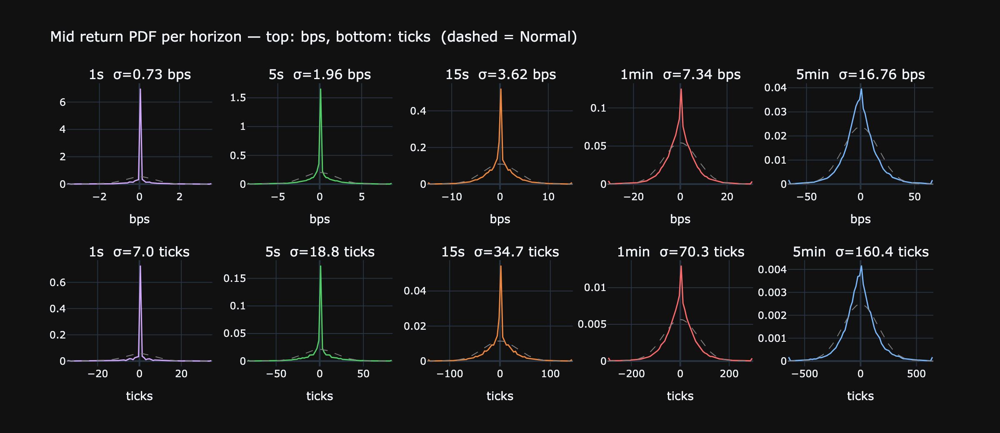

### 7.2 Range of mid within window

Внутри окна Δt — какова амплитуда (max−min) mid в bps? Это «то, что мы пропустим, если будем смотреть на снимок раз в Δt».

```python
mid_grid = lobs.set_index('ts')['mid'].resample('100ms').last().ffill()
windows  = [(5,'500ms'), (10,'1s'), (50,'5s'), (300,'30s'), (600,'1min')]

rows = []
for w, label in windows:
    rmax = mid_grid.rolling(w).max()
    rmin = mid_grid.rolling(w).min()
    rng  = (rmax - rmin) / mid_grid * 1e4  # bps
    rows.append({
        'window':   label,
        'median (bps)': round(rng.median(), 2),
        'p90':         round(rng.quantile(0.90), 2),
        'p99':         round(rng.quantile(0.99), 2),
        'max':         round(rng.max(), 1),
    })
pd.DataFrame(rows)
```

**Result:**
```
  window  median (bps)    p90    p99    max
0  500ms          0.00   0.38   1.84   43.9
1     1s          0.00   0.87   2.91   43.9
2     5s          0.52   3.20   7.82   86.0
3    30s          3.79   9.95  21.51  103.5
4   1min          6.37  14.85  32.47  103.5
```

### 7.3 Microprice predictiveness

Корреляция `microprice − mid` (текущий «edge» в копейках от баланса L1) с `mid_{t+k} − mid_t` (будущим движением). При k=1 — насколько microprice предсказывает следующий снапшот.

```python
edge = lobs['microprice'] - lobs['mid']
rows = []
for k in [1, 5, 10, 30, 100]:
    fwd = lobs['mid'].shift(-k) - lobs['mid']
    rows.append({'horizon (snapshots)': k,
                 'corr(edge, Δmid_+k)': round(edge.corr(fwd), 3)})
print(pd.DataFrame(rows).to_string(index=False))
```

**Output:**
```
 horizon (snapshots)  corr(edge, Δmid_+k)
                   1                0.087
                   5                0.052
                  10                0.041
                  30                0.024
                 100                0.020
```

## 8. Fee economics

Сколько реально стоит торговать активом после rebate? `fee < 0` — top-tier maker rebate.

```python
maker_legs = trades[~trades['crossed']]
taker_legs = trades[ trades['crossed']]

# Notional (USDC) traded
trades['notional'] = trades['sz'] * trades['px']
v_maker = trades.loc[~trades['crossed'], 'notional'].sum()
v_taker = trades.loc[ trades['crossed'], 'notional'].sum()

# Effective rate per side: total fee / total notional, in bps
eff_maker = maker_legs['fee'].sum() / v_maker * 1e4
eff_taker = taker_legs['fee'].sum() / v_taker * 1e4

# Rebate share
rebate_count_share  = (maker_legs['fee'] < 0).mean() * 100
rebate_volume_share = maker_legs.loc[maker_legs['fee']<0, 'notional'].sum() \
                    / maker_legs['notional'].sum() * 100

stats = pd.DataFrame({'value': [
    f'{eff_maker:+.3f} bps',
    f'{eff_taker:+.3f} bps',
    f'{eff_maker + eff_taker:+.3f} bps',
    f'{rebate_count_share:.1f} %',
    f'{rebate_volume_share:.1f} %',
    f'{maker_legs.loc[maker_legs["fee"]<0, "fee"].mean():.4f} USDC',
    f'{taker_legs["fee"].mean():.4f} USDC',
]}, index=[
    'Effective maker rate (volume-weighted)',
    'Effective taker rate (volume-weighted)',
    'Round-trip cost (maker+taker)',
    'Maker fills with rebate (count)',
    'Maker volume on rebate',
    'Avg rebate per maker fill',
    'Avg taker fee',
])
print(stats.to_string())
```

**Output:**
```
                                               value
Effective maker rate (volume-weighted)    +0.124 bps
Effective taker rate (volume-weighted)    +4.187 bps
Round-trip cost (maker+taker)             +4.311 bps
Maker fills with rebate (count)               45.9 %
Maker volume on rebate                        63.6 %
Avg rebate per maker fill               -0.0188 USDC
Avg taker fee                            0.2416 USDC
```

```python
# Distribution of fee values for both sides
fig = make_subplots(rows=1, cols=2, subplot_titles=[
    'Maker fee (rebate < 0, basic > 0)', 'Taker fee'])
fig.add_trace(go.Histogram(x=maker_legs['fee'].clip(-0.5, 0.5),
                          nbinsx=80, marker_color='#d2a8ff'), 1, 1)
fig.add_vline(x=0, line_dash='dot', line_color='gray', row=1, col=1)
fig.add_trace(go.Histogram(x=taker_legs['fee'].clip(0, 1.0),
                          nbinsx=80, marker_color='#f0883e'), 1, 2)
fig.update_xaxes(title_text='USDC', row=1, col=1)
fig.update_xaxes(title_text='USDC', row=1, col=2)
fig.update_layout(template=THEME, height=350, showlegend=False)
show(fig)
```

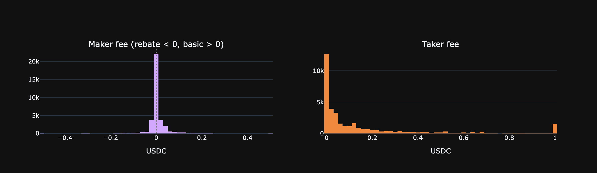

## 9. Funding rate

Исторические hourly funding rates за апрель 2026 через Hyperliquid API.
Funding платится **каждый час** (не раз в 8h); формула: `F_8h = premium + clamp(0.01% − premium, ±0.05%)`, hourly = F_8h / 8.

```python
import urllib.request, json as _json, ssl as _ssl

_ctx = _ssl.create_default_context()
_ctx.check_hostname = False
_ctx.verify_mode = _ssl.CERT_NONE

_start = int(pd.Timestamp('2026-04-01', tz='UTC').timestamp() * 1000)
_end   = int(pd.Timestamp('2026-04-11', tz='UTC').timestamp() * 1000)

_req = urllib.request.Request(
    'https://api.hyperliquid.xyz/info',
    data=_json.dumps({'type': 'fundingHistory', 'coin': ASSET_NAME,
                      'startTime': _start, 'endTime': _end}).encode(),
    headers={'Content-Type': 'application/json'}, method='POST')
with urllib.request.urlopen(_req, timeout=15, context=_ctx) as _r:
    _raw = _json.loads(_r.read())

fund = pd.DataFrame(_raw)
fund['ts']   = pd.to_datetime(fund['time'], unit='ms', utc=True)
fund['rate'] = fund['fundingRate'].astype(float) * 1e4   # bps/hr
fund['prem'] = fund['premium'].astype(float) * 1e4       # bps
fund = fund.sort_values('ts').reset_index(drop=True)

print(f'Records: {len(fund)}  ({fund.ts.min().date()} – {fund.ts.max().date()})')
print(fund[['rate','prem']].describe().round(4).to_string())
```

**Output:**
```
Records: 240  (2026-04-01 – 2026-04-10)
           rate      prem
count  240.0000  240.0000
mean     0.0821   -3.1668
std      0.0875    1.7162
min     -0.3372   -7.6975
25%      0.0823   -4.3416
50%      0.1250   -3.2729
75%      0.1250   -1.9072
max      0.1250    0.8623
```

```python
fig = make_subplots(rows=2, cols=1, shared_xaxes=True,
    subplot_titles=['Hourly funding rate (bps/hr)', 'Mark−Oracle premium (bps)'],
    row_heights=[0.5, 0.5])

fig.add_trace(go.Scatter(x=fund['ts'], y=fund['rate'], mode='lines',
    line=dict(color='#d2a8ff', width=1), name='funding rate'), row=1, col=1)
fig.add_hline(y=0,       line_dash='dot', line_color='gray', row=1, col=1)
fig.add_hline(y=0.00125, line_dash='dash', line_color='#f0883e',
              annotation_text='floor 0.00125 bps/hr', annotation_position='right',
              row=1, col=1)

fig.add_trace(go.Scatter(x=fund['ts'], y=fund['prem'], mode='lines',
    line=dict(color='#51cf66', width=1), name='premium'), row=2, col=1)
fig.add_hline(y=0, line_dash='dot', line_color='gray', row=2, col=1)

fig.update_yaxes(title_text='bps/hr', row=1, col=1)
fig.update_yaxes(title_text='bps',    row=2, col=1)
fig.update_layout(template=THEME, height=420, showlegend=False,
    title=f'{ASSET_NAME}-USDC perp funding rate & premium — Apr 2026')
show(fig)
```

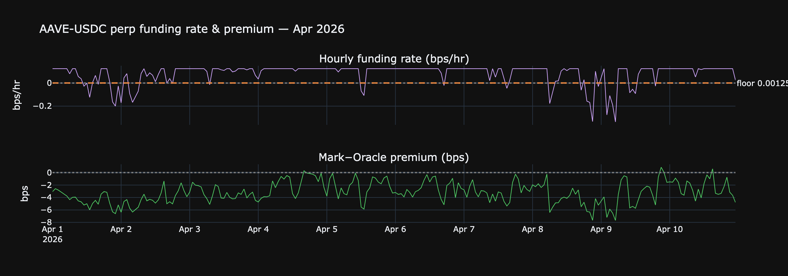

```python
floor_bps   = 0.00125   # theoretical floor
neg_pct     = (fund['rate'] < 0).mean() * 100
below_floor = (fund['rate'] < floor_bps).mean() * 100

print(f'Negative rate (shorts pay longs): {neg_pct:.1f}% of hours')
print(f'Below theoretical floor ({floor_bps} bps/hr): {below_floor:.1f}% of hours')
print(f'Mean rate: {fund["rate"].mean():.4f} bps/hr  = {fund["rate"].mean()*24:.3f} bps/day')
print(f'Mean premium: {fund["prem"].mean():.2f} bps  (persistently negative = mark < oracle)')

# Cumulative funding on a +1 symbol long position
price   = lobs['mid'].mean()
cum_usdc    = (fund['rate'] / 1e4 * price).cumsum()   # USDC per symbol

fig = make_subplots(rows=1, cols=2,
    subplot_titles=['Funding rate distribution', f'Cumulative cost: +1 {ASSET_NAME} long (USDC)'])

c, e = np.histogram(fund['rate'], bins=40, density=True)
fig.add_trace(go.Bar(x=0.5*(e[:-1]+e[1:]), y=c, marker_color='#d2a8ff',
    name='rate dist'), row=1, col=1)
fig.add_vline(x=0,          line_dash='dot', line_color='gray', row=1, col=1)
fig.add_vline(x=floor_bps,  line_dash='dash', line_color='#f0883e', row=1, col=1)

fig.add_trace(go.Scatter(x=fund['ts'], y=cum_usdc, mode='lines',
    line=dict(color='#51cf66', width=2), name='cumulative'), row=1, col=2)
fig.add_hline(y=0, line_dash='dot', line_color='gray', row=1, col=2)

fig.update_xaxes(title_text='bps/hr', row=1, col=1)
fig.update_yaxes(title_text='USDC earned (+) / paid (−)', row=1, col=2)
fig.update_layout(template=THEME, height=360, showlegend=False,
    title=f'Funding distribution & cumulative P&L for +1 {ASSET_NAME} long over {len(fund)} hours')
show(fig)
```

**Output:**
```
Negative rate (shorts pay longs): 14.2% of hours
Below theoretical floor (0.00125 bps/hr): 14.2% of hours
Mean rate: 0.0821 bps/hr  = 1.969 bps/day
Mean premium: -3.17 bps  (persistently negative = mark < oracle)
```

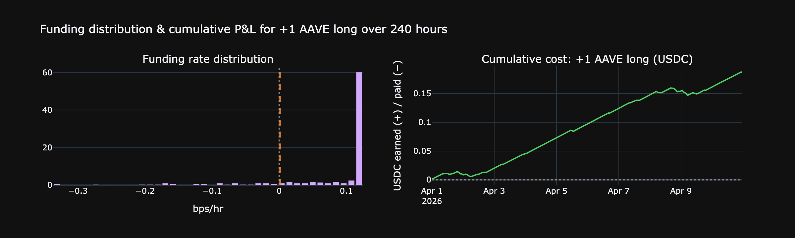

```python
# Intraday pattern — avg funding rate by hour of day UTC
fund['hour'] = fund['ts'].dt.hour
by_hour = fund.groupby('hour')[['rate', 'prem']].mean()

fig = make_subplots(rows=1, cols=2,
    subplot_titles=['Avg funding rate by hour UTC', 'Avg premium by hour UTC'])
fig.add_trace(go.Bar(x=by_hour.index, y=by_hour['rate'],
    marker_color='#d2a8ff', name='rate'), row=1, col=1)
fig.add_trace(go.Bar(x=by_hour.index, y=by_hour['prem'],
    marker_color='#51cf66', name='premium'), row=1, col=2)
fig.add_hline(y=0, line_dash='dot', line_color='gray', row=1, col=1)
fig.add_hline(y=0, line_dash='dot', line_color='gray', row=1, col=2)
fig.update_xaxes(title_text='hour (UTC)', dtick=4)
fig.update_yaxes(title_text='bps/hr', row=1, col=1)
fig.update_yaxes(title_text='bps',    row=1, col=2)
fig.update_layout(template=THEME, height=340, showlegend=False,
    title='Intraday funding pattern — averaged across Apr 2026')
show(fig)
```

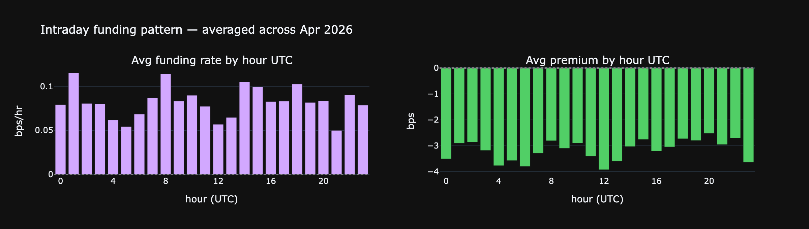

## 10. Market participants

Уникально для DEX — мы видим адреса всех контрагентов. Кто и в каких пропорциях торгует актив.

### 10.1 Top users by volume

```python
trades['notional'] = trades['sz'] * trades['px']
u = trades.groupby('user').agg(
    n_legs=('sz', 'count'),
    n_taker=('crossed', 'sum'),
    sz_total=('sz', 'sum'),
    notional=('notional', 'sum'),
    fee_total=('fee', 'sum'),
)
u['n_maker']      = u['n_legs'] - u['n_taker']
u['maker_share']  = u['n_maker'] / u['n_legs']
u['rebate_total'] = (-u['fee_total']).clip(lower=0)  # if net negative fee = received rebate

top = u.sort_values('notional', ascending=False).head(20).copy()
top['notional_M']    = (top['notional'] / 1e6).round(2)
top['maker_share_%'] = (top['maker_share']*100).round(1)
top[['n_legs','n_taker','n_maker','maker_share_%','notional_M','fee_total']] \
    .rename(columns={'notional_M':'notional ($M)', 'fee_total':'net fee (USDC)'})
```

**Result:**
```
                                            n_legs  n_taker  n_maker  \
user                                                                   
0x8038f072d9c4df90d7aa6c72a698cdb9046192f4    1127     1127        0   
0xd071d6d6ea52f5aa34b79e47f908ee48c8215837    6040        0     6040   
0x0a06ec6754b628be489b2c40bba20c8580392a7b     559      290      269   
0xf9109ada2f73c62e9889b45453065f0d99260a2d    1671        5     1666   
0xac7476e14f768e3e67c195e79c2490dd20c70127    2336     1969      367   
0x15094c3ec74e8a43c082042815e0c135deebb152    1625       11     1614   
0x654016a8c9fcf0c4cb7ed6078aba21f7f399f7b7     760      733       27   
0x6ba889db7f923622d3548f621ecc2054b80c1817    5481      984     4497   
0x010461c14e146ac35fe42271bdc1134ee31c703a    5032     3125     1907   
0x8184405076b61ab78013f16393322eaf0d0a01a1    4480     2713     1767   
0x31ca8395cf837de08b24da3f660e77761dfb974b    4782     2986     1796   
0x348e5365acfa48a26ada7da840ca611e29c950ef     460      371       89   
0x8b0be882a693ad3849f9bfde6951ec36489f30be     690      690        0   
0x0bfd7d7721f4c116e853c18ea7998e1cc2350a7d    1974     1446      528   
0x420b2bbe06002bbc2d26b1599cc8bcf7b37278bf     453      267      186   
0x7717a7a245d9f950e586822b8c9b46863ed7bd7e    2084      133     1951   
0xc54d61563ab63e7af28ed30c5cdfdc4e9906f0f7     287      287        0   
0xdbcc96bcada067864902aad14e029fe7c422f147     327        0      327   
0xfdf1e791b257b259d2e2967a0b525d0e777d67fe     472      466        6   
0x69523edb8337e624ea97a0c097ac5d3dede8e3d5     541      539        2   

                                            maker_share_%  notional ($M)  \
user                                                                       
0x8038f072d9c4df90d7aa6c72a698cdb9046192f4            0.0           3.49   
0xd071d6d6ea52f5aa34b79e47f908ee48c8215837          100.0           3.15   
0x0a06ec6754b628be489b2c40bba20c8580392a7b           48.1           3.04   
0xf9109ada2f73c62e9889b45453065f0d99260a2d           99.7           1.95   
0xac7476e14f768e3e67c195e79c2490dd20c70127           15.7           1.77   
0x15094c3ec74e8a43c082042815e0c135deebb152           99.3           1.73   
0x654016a8c9fcf0c4cb7ed6078aba21f7f399f7b7            3.6           1.69   
0x6ba889db7f923622d3548f621ecc2054b80c1817           82.0           1.57   
0x010461c14e146ac35fe42271bdc1134ee31c703a           37.9           1.28   
0x8184405076b61ab78013f16393322eaf0d0a01a1           39.4           1.24   
0x31ca8395cf837de08b24da3f660e77761dfb974b           37.6           1.23   
0x348e5365acfa48a26ada7da840ca611e29c950ef           19.3           0.98   
0x8b0be882a693ad3849f9bfde6951ec36489f30be            0.0           0.97   
0x0bfd7d7721f4c116e853c18ea7998e1cc2350a7d           26.7           0.97   
0x420b2bbe06002bbc2d26b1599cc8bcf7b37278bf           41.1           0.77   
0x7717a7a245d9f950e586822b8c9b46863ed7bd7e           93.6           0.76   
0xc54d61563ab63e7af28ed30c5cdfdc4e9906f0f7            0.0           0.49   
0xdbcc96bcada067864902aad14e029fe7c422f147          100.0           0.46   
0xfdf1e791b257b259d2e2967a0b525d0e777d67fe            1.3           0.41   
0x69523edb8337e624ea97a0c097ac5d3dede8e3d5            0.4           0.41   

                                            net fee (USDC)  
user                                                        
0x8038f072d9c4df90d7aa6c72a698cdb9046192f4     3251.017141  
0xd071d6d6ea52f5aa34b79e47f908ee48c8215837      -31.526480  
0x0a06ec6754b628be489b2c40bba20c8580392a7b      -31.371729  
0xf9109ada2f73c62e9889b45453065f0d99260a2d      -56.458599  
0xac7476e14f768e3e67c195e79c2490dd20c70127      178.162710  
0x15094c3ec74e8a43c082042815e0c135deebb152      -49.112569  
0x654016a8c9fcf0c4cb7ed6078aba21f7f399f7b7      585.831645  
0x6ba889db7f923622d3548f621ecc2054b80c1817       92.430026  
0x010461c14e146ac35fe42271bdc1134ee31c703a        0.000000  
0x8184405076b61ab78013f16393322eaf0d0a01a1      128.972941  
0x31ca8395cf837de08b24da3f660e77761dfb974b        0.000000  
0x348e5365acfa48a26ada7da840ca611e29c950ef       46.138922  
0x8b0be882a693ad3849f9bfde6951ec36489f30be      221.723339  
0x0bfd7d7721f4c116e853c18ea7998e1cc2350a7d      115.721506  
0x420b2bbe06002bbc2d26b1599cc8bcf7b37278bf      285.983710  
0x7717a7a245d9f950e586822b8c9b46863ed7bd7e       35.925649  
0xc54d61563ab63e7af28ed30c5cdfdc4e9906f0f7      221.771685  
0xdbcc96bcada067864902aad14e029fe7c422f147       55.799882  
0xfdf1e791b257b259d2e2967a0b525d0e777d67fe      176.351992  
0x69523edb8337e624ea97a0c097ac5d3dede8e3d5      133.357333
```

### 10.2 Maker / taker mix per user

Каждая точка — кошелёк. По X — общий объём (log-scale), по Y — доля maker fills. Реальные MM сидят в правом верхнем углу (большой объём + 90%+ maker).

```python
# Filter to users with meaningful activity to declutter
u_plot = u[u['n_legs'] >= 50].copy()

fig = go.Figure()
fig.add_trace(go.Scatter(
    x=u_plot['notional'], y=u_plot['maker_share']*100,
    mode='markers',
    marker=dict(color=u_plot['n_legs'], colorscale='Magma',
                size=6, opacity=0.6,
                colorbar=dict(title='# fills')),
    text=u_plot.index,
    hovertemplate='user: %{text}<br>volume: $%{x:,.0f}<br>maker: %{y:.1f}%'
))
fig.update_xaxes(type='log', title_text='notional volume (USDC, log)')
fig.update_yaxes(title_text='maker share (%)', range=[0, 105])
fig.update_layout(template=THEME, height=420,
    title=f'Per-user maker share vs volume  (N = {len(u_plot):,} users with ≥50 fills)')
show(fig)
```

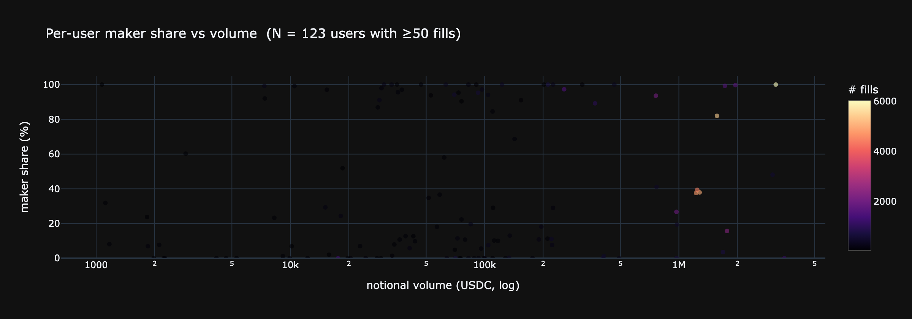

### 10.3 Concentration of activity

```python
sorted_v = u['notional'].sort_values().values
N        = len(sorted_v)
total    = sorted_v.sum()
top5     = u['notional'].nlargest(5).sum()  / total
top20    = u['notional'].nlargest(20).sum() / total
top100   = u['notional'].nlargest(100).sum() / total

# Gini
gini = (2 * np.sum(np.arange(1, N+1) * sorted_v) / (N * total)) - (N+1)/N

stats = pd.DataFrame({'value': [
    f'{N:,}',
    f'{top5*100:.1f} %',
    f'{top20*100:.1f} %',
    f'{top100*100:.1f} %',
    f'{gini:.3f}',
]}, index=['Unique users', 'Top-5 share', 'Top-20 share',
          'Top-100 share', 'Gini of volume'])
print(stats.to_string())
```

**Output:**
```
                 value
Unique users     2,085
Top-5 share     32.6 %
Top-20 share    69.1 %
Top-100 share   90.0 %
Gini of volume   0.962
```

```python
# Lorenz curve
cum_users = np.arange(1, N+1) / N * 100
cum_vol   = np.cumsum(sorted_v) / total * 100

fig = go.Figure()
fig.add_trace(go.Scatter(x=cum_users, y=cum_vol, mode='lines',
                         line=dict(color='#d2a8ff'), name='Lorenz'))
fig.add_trace(go.Scatter(x=[0,100], y=[0,100], mode='lines',
                         line=dict(color='gray', dash='dot'),
                         name='perfect equality'))
fig.update_layout(template=THEME, height=380,
    title=f'Lorenz curve of user volume  —  Gini = {gini:.3f}',
    xaxis_title='% of users (sorted by volume)',
    yaxis_title='% of cumulative volume')
show(fig)
```

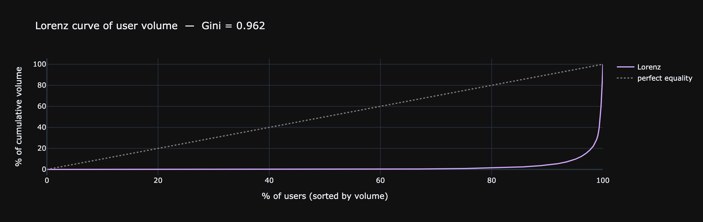

### 10.4 Open vs Close flow

`dir` различает открытие и закрытие позиции. Баланс между ними — чистый flow leverage on/off.

```python
flow = trades.groupby('dir').agg(n=('sz','count'),
                                 vol=('notional','sum'))
flow['count_%']  = (flow['n']  / flow['n'].sum()  * 100).round(1)
flow['volume_%'] = (flow['vol']/ flow['vol'].sum()* 100).round(1)
flow['vol_M']    = (flow['vol']/1e6).round(1)

print(flow[['n','count_%','vol_M','volume_%']]
      .rename(columns={'vol_M':'volume ($M)'}).to_string())

opens  = flow.loc[flow.index.str.startswith('Open'),  'vol'].sum()
closes = flow.loc[flow.index.str.startswith('Close'), 'vol'].sum()
print(f'\nOpen:  ${opens/1e6:.1f}M  ({opens/(opens+closes)*100:.1f}%)')
print(f'Close: ${closes/1e6:.1f}M  ({closes/(opens+closes)*100:.1f}%)')
```

**Output:**
```
                  n  count_%  volume ($M)  volume_%
dir                                                
Close Long    14152     19.9          8.6      20.8
Close Short   20004     28.1         11.0      26.9
Long > Short    655      0.9          0.8       2.0
Open Long     14907     21.0          8.5      20.8
Open Short    20762     29.2         11.1      27.1
Short > Long    658      0.9          1.0       2.4

Open:  $19.7M  (50.1%)
Close: $19.6M  (49.9%)
```

