# DataAnalysis — extracted outputs
Source: `/Users/stepan/Desktop/hyperliquid-hft/research/LINK/DataAnalysis.ipynb`
---
## 1. Reading data

```python
import sys
import os

sys.path.insert(0, "/Users/stepan/Desktop/hyperliquid-hft")
os.chdir("/Users/stepan/Desktop/hyperliquid-hft")

from analysis.readers import LobReaderRaw, LobReader, TradesReaderRaw, TradesReader
```

```python
ASSET_NAME = 'LINK'
TICK = 0.0001
```

```python
DAYS = 5

lob_paths = [
    f"data/{ASSET_NAME}/lob/202604{day:02d}/{hour:02d}.lz4"
    for day in range(1, DAYS + 1)
    for hour in range(0, 24)
]
trades_paths = [
    f"data/{ASSET_NAME}/trades/202604{day:02d}/{hour:02d}.lz4"
    for day in range(1, DAYS + 1)
    for hour in range(0, 24)
]
```

```python
lobs = LobReader(lob_paths).load()

lobs
```

**Result:**
```
              time_ms  bid_px_0  bid_sz_0  bid_n_0  bid_px_1  bid_sz_1  \
0       1775001612017    8.7783     181.1        2    8.7776     100.0   
1       1775001612773    8.7807      73.5        1    8.7789     150.0   
2       1775001613178    8.7807      73.5        1    8.7789     150.0   
3       1775001613684    8.7807      73.5        1    8.7789     150.0   
4       1775001614255    8.7807      73.5        1    8.7789     150.0   
...               ...       ...       ...      ...       ...       ...   
778423  1775433595935    8.8199    1271.2        3    8.8198     305.7   
778424  1775433596467    8.8200      64.0        1    8.8199    1312.7   
778425  1775433597010    8.8201      22.5        1    8.8200     593.0   
778426  1775433597551    8.8202      64.0        1    8.8201      22.5   
778427  1775433598087    8.8202      64.0        1    8.8201      22.5   

        bid_n_1  bid_px_2  bid_sz_2  bid_n_2  ...  ask_n_16  ask_px_17  \
0             1    8.7775    2187.6        2  ...         1     8.7874   
1             1    8.7786     152.9        1  ...         1     8.7872   
2             1    8.7786     152.9        1  ...         1     8.7872   
3             1    8.7786     152.9        1  ...         1     8.7874   
4             1    8.7786     152.9        1  ...         1     8.7874   
...         ...       ...       ...      ...  ...       ...        ...   
778423        1    8.8197      64.0        1  ...         1     8.8257   
778424        3    8.8198     305.7        1  ...         2     8.8255   
778425        2    8.8199     719.5        1  ...         2     8.8255   
778426        1    8.8200     529.0        1  ...         3     8.8262   
778427        1    8.8200     529.0        1  ...         2     8.8269   

        ask_sz_17  ask_n_17  ask_px_18  ask_sz_18  ask_n_18  ask_px_19  \
0          1047.1         1     8.7875      229.1         1     8.7877   
1           149.8         1     8.7874     1047.1         1     8.7875   
2           149.8         1     8.7874     1047.1         1     8.7875   
3          1047.1         1     8.7877        2.3         1     8.7881   
4          1047.1         1     8.7877        2.3         1     8.7881   
...           ...       ...        ...        ...       ...        ...   
778423     1339.6         1     8.8258     3400.1         1     8.8259   
778424      115.9         1     8.8257     1339.6         1     8.8258   
778425      115.9         1     8.8257     1339.6         1     8.8258   
778426      156.5         2     8.8269      622.1         2     8.8270   
778427      622.1         2     8.8270      931.4         2     8.8271   

        ask_sz_19  ask_n_19  
0             2.3         1  
1           229.1         1  
2           229.1         1  
3          1255.6         1  
4          1255.6         1  
...           ...       ...  
778423      440.5         1  
778424     3400.1         1  
778425     3400.1         1  
778426      931.4         2  
778427      219.0         1  

[778428 rows x 121 columns]
```

```python
trades = TradesReader(trades_paths).load()

trades
```

**Result:**
```
             time_ms              tid      px     sz side  crossed       fee  \
0      1775001603330  599584346121590  8.7789   21.3    B    False -0.001869   
1      1775001603330  599584346121590  8.7789   21.3    A     True  0.000000   
2      1775001605520  663340109977047  8.7798   61.7    A    False  0.015167   
3      1775001605520  663340109977047  8.7798   61.7    B     True  0.000000   
4      1775001608242  677167600154179  8.7790    2.6    A     True  0.000000   
...              ...              ...     ...    ...  ...      ...       ...   
91441  1775433544297  917866156523095  8.8172    1.8    B     True  0.000000   
91442  1775433585713  672352312219341  8.8167    1.8    B    False -0.000476   
91443  1775433585713  672352312219341  8.8167    1.8    A     True  0.000000   
91444  1775433594575  134228426699752  8.8178  199.4    B     True  0.253190   
91445  1775433594575  134228426699752  8.8178  199.4    A    False  0.189893   

                                             user          dir  startPosition  
0      0x9266865bb6afb4c4f618544dd3b8c970f17aa664  Close Short        -1710.7  
1      0x31ca8395cf837de08b24da3f660e77761dfb974b   Open Short       -13952.3  
2      0x6ba889db7f923622d3548f621ecc2054b80c1817   Open Short        -2940.8  
3      0x31ca8395cf837de08b24da3f660e77761dfb974b  Close Short       -13973.6  
4      0x010461c14e146ac35fe42271bdc1134ee31c703a   Close Long        13767.1  
...                                           ...          ...            ...  
91441  0x010461c14e146ac35fe42271bdc1134ee31c703a    Open Long        14060.8  
91442  0x727956612a8700627451204a3ae26268bd1a1525  Close Short         -190.7  
91443  0x010461c14e146ac35fe42271bdc1134ee31c703a   Close Long        14062.6  
91444  0xd02928c445d780ea954fe0b6f0be0f6cb9727678  Close Short       -11227.1  
91445  0xf032648dfd22c4d81588bd83e09ab89cfe816705   Open Short         -561.0  

[91446 rows x 10 columns]
```

## Setup — derived columns, run once

```python
# Целостность trades по tid — каноничному id матча.
# Инвариант: каждый tid встречается ровно 2 раза (taker leg + maker leg)
# с противоположными side и одним и тем же time_ms / px / sz.
agg = trades.groupby('tid', sort=False).agg(
    n=('crossed', 'size'),
    n_tak=('crossed', 'sum'),
    n_sides=('side', 'nunique'),
    n_time=('time_ms', 'nunique'),
    n_px=('px', 'nunique'),
    n_sz=('sz', 'nunique'),
)
ok = (agg['n'] == 2) & (agg['n_tak'] == 1) & (agg['n_sides'] == 2) \
   & (agg['n_time'] == 1) & (agg['n_px'] == 1) & (agg['n_sz'] == 1)

print(f'Rows: {len(trades):,}  '
      f'({trades["crossed"].sum():,} taker / {(~trades["crossed"]).sum():,} maker)')
print(f'Unique tids: {len(agg):,}   well-formed: {ok.sum():,}  ({ok.mean()*100:.4f}%)')

if (~ok).any():
    print(f'\nMalformed tids: {(~ok).sum()}')
    print(agg[~ok].head())

assert ok.all(), 'Trade integrity broken — see above'
```

**Output:**
```
Rows: 91,446  (45,723 taker / 45,723 maker)
Unique tids: 45,723   well-formed: 45,723  (100.0000%)
```

```python
import numpy as np
import pandas as pd
import plotly.graph_objects as go
import plotly.io as pio
from plotly.subplots import make_subplots

# default = 'browser' открывает фигуры в новой вкладке; для inline в Lab/Notebook нужен 'notebook'
# Persistent rendering — embeds Plotly.js inline on first call, no CDN
from IPython.display import display as _display, HTML as _HTML
_plotly_injected = False
def show(fig):
    global _plotly_injected
    _display(_HTML(fig.to_html(include_plotlyjs=not _plotly_injected, full_html=False)))
    _plotly_injected = True
from scipy import stats as sps

LEVELS = 20
THEME  = 'plotly_dark'

# LOB — add derived columns once
lobs['ts']           = pd.to_datetime(lobs['time_ms'], unit='ms')
lobs['mid']          = (lobs['bid_px_0'] + lobs['ask_px_0']) / 2
lobs['spread']       =  lobs['ask_px_0'] - lobs['bid_px_0']
lobs['spread_ticks'] = (lobs['spread'] / TICK).round().astype(int)
lobs['spread_bps']   =  lobs['spread'] / lobs['mid'] * 1e4
lobs['imb']          = (lobs['bid_sz_0'] - lobs['ask_sz_0']) / (lobs['bid_sz_0'] + lobs['ask_sz_0'])
# Stoikov 2018 microprice — weights L1 by *opposite* side size
lobs['microprice']   = (lobs['ask_sz_0'] * lobs['bid_px_0']
                      + lobs['bid_sz_0'] * lobs['ask_px_0']) / (lobs['bid_sz_0'] + lobs['ask_sz_0'])

# Trades — each match has 2 rows (taker leg + maker leg).
# crossed=True is the taker leg → 1 row per fill, side = aggressor direction.
trades['ts'] = pd.to_datetime(trades['time_ms'], unit='ms')
taker        = trades[trades['crossed']].copy()
taker['agg'] = taker['side'].map({'B': 'buy', 'A': 'sell'})  # market buy / market sell

print(f'LOB:   {len(lobs):,} snapshots,  {lobs["ts"].iloc[0]} → {lobs["ts"].iloc[-1]}')
print(f'Taker: {len(taker):,} fills (= unique trades)')
```

**Output:**
```
LOB:   778,428 snapshots,  2026-04-01 00:00:12.017000 → 2026-04-05 23:59:58.087000
Taker: 45,723 fills (= unique trades)
```

## 1. General statistics

```python
duration   = lobs['ts'].iloc[-1] - lobs['ts'].iloc[0]
snap_dt_ms = lobs['time_ms'].diff().median()
maker_legs = trades[~trades['crossed']]
rebate_pct = (maker_legs['fee'] < 0).mean() * 100  # share of maker fills that got top-tier rebate

stats = pd.DataFrame({'value': [
    f'{lobs["ts"].iloc[0]:%Y-%m-%d %H:%M} → {lobs["ts"].iloc[-1]:%Y-%m-%d %H:%M}',
    str(duration).split('.')[0],
    f'{len(lobs):,}',
    f'{snap_dt_ms:.0f} ms',
    f'{len(taker):,}',
    f'{len(taker)/duration.total_seconds():.2f} /sec',
    f'{rebate_pct:.1f} %',
    f'${lobs["mid"].min():.2f}  /  ${lobs["mid"].max():.2f}',
    f'{lobs["spread_ticks"].mean():.2f} ticks  ({lobs["spread_bps"].mean():.2f} bps)',
]}, index=[
    'Period (UTC)', 'Duration', 'LOB snapshots', 'Median snap Δt',
    'Taker fills', 'Trade rate', 'Maker fills with rebate', 'Mid range', 'Mean spread',
])
stats
```

**Result:**
```
                                                       value
Period (UTC)             2026-04-01 00:00 → 2026-04-05 23:59
Duration                                     4 days 23:59:46
LOB snapshots                                        778,428
Median snap Δt                                        537 ms
Taker fills                                           45,723
Trade rate                                         0.11 /sec
Maker fills with rebate                               37.1 %
Mid range                                    $8.42  /  $9.19
Mean spread                           7.60 ticks  (0.87 bps)
```

## 2. Asset overview

### 2.1 Price + trade flow — first 30 minutes

```python
# 30-min window for time-series plots; tables/stats keep using full lobs/taker.
T0      = lobs['ts'].iloc[0]
T1      = T0 + pd.Timedelta('30min')
lob30   = lobs[(lobs['ts'] >= T0) & (lobs['ts'] < T1)]
trd30   = taker[(taker['ts'] >= T0) & (taker['ts'] < T1)]

buys    = trd30[trd30['agg']=='buy']
sells   = trd30[trd30['agg']=='sell']
buy_v   = buys.set_index('ts')['sz'].resample('5s').sum()
sell_v  = sells.set_index('ts')['sz'].resample('5s').sum()

fig = make_subplots(rows=2, cols=1, shared_xaxes=True, row_heights=[0.7, 0.3],
    subplot_titles=['Mid + bid/ask + trades', 'Buy/sell volume (5s bars)'])

fig.add_trace(go.Scatter(x=lob30['ts'], y=lob30['ask_px_0'], name='ask', line=dict(color='#ff6b6b', width=0.7)), 1, 1)
fig.add_trace(go.Scatter(x=lob30['ts'], y=lob30['bid_px_0'], name='bid', line=dict(color='#51cf66', width=0.7)), 1, 1)
fig.add_trace(go.Scatter(x=lob30['ts'], y=lob30['mid'],      name='mid', line=dict(color='#d2a8ff', width=1.2)), 1, 1)
fig.add_trace(go.Scatter(x=buys['ts'],  y=buys['px'],  name='buy',  mode='markers',
                         marker=dict(color='#51cf66', size=4, symbol='triangle-up')),   1, 1)
fig.add_trace(go.Scatter(x=sells['ts'], y=sells['px'], name='sell', mode='markers',
                         marker=dict(color='#ff6b6b', size=4, symbol='triangle-down')), 1, 1)

fig.add_trace(go.Bar(x=buy_v.index,  y=buy_v.values,   name='buy vol',  marker_color='#51cf66'), 2, 1)
fig.add_trace(go.Bar(x=sell_v.index, y=-sell_v.values, name='sell vol', marker_color='#ff6b6b'), 2, 1)

fig.update_layout(template=THEME, height=600, barmode='relative', showlegend=True)
show(fig)
```

_(figure 1 — could not parse HTML)_

### 2.2 Spread — time series

```python
fig = go.Figure()
fig.add_trace(go.Scatter(x=lob30['ts'], y=lob30['spread_ticks'],
    mode='lines', line=dict(color='#d2a8ff', width=0.8),
    fill='tozeroy', fillcolor='rgba(210,168,255,0.12)', name='spread'))
fig.add_hline(y=lobs['spread_ticks'].mean(), line_dash='dash', line_color='#f0883e',
    annotation_text=f'full-period mean = {lobs["spread_ticks"].mean():.2f} ticks')
fig.update_layout(template=THEME, height=300,
    title='Spread (ticks) — first 30 min, dashed line = mean over full dataset',
    yaxis_title='ticks')
show(fig)
```

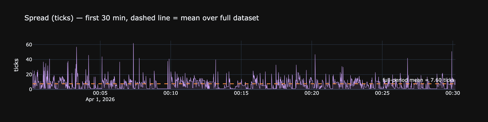

### 2.3 Spread — distribution & autocorrelation

```python
SPREAD_X_MAX = 30   # граница справа на первых двух графиках; увеличь чтобы увидеть хвост

s   = lobs['spread_ticks']
vc  = s.value_counts(normalize=True).sort_index()  # share of time at each spread
acf = [s.autocorr(k) for k in range(1, 51)]
ci  = 1.96 / np.sqrt(len(s))

fig = make_subplots(rows=1, cols=3, subplot_titles=[
  'Distribution (% of time)', 'CDF', 'Autocorrelation (lags 1–50)'])

fig.add_trace(go.Bar(x=vc.index, y=vc.values*100, marker_color='#d2a8ff'), 1, 1)
fig.add_trace(go.Scatter(x=vc.index, y=vc.cumsum().values*100, mode='lines',
                       line=dict(color='#51cf66')), 1, 2)
fig.add_trace(go.Bar(x=list(range(1, 51)), y=acf, marker_color='#d2a8ff'), 1, 3)
fig.add_hline(y= ci, line_dash='dot', line_color='gray', row=1, col=3)
fig.add_hline(y=-ci, line_dash='dot', line_color='gray', row=1, col=3)

fig.update_xaxes(title_text='ticks', range=[0, SPREAD_X_MAX], row=1, col=1)
fig.update_xaxes(title_text='ticks', range=[0, SPREAD_X_MAX], row=1, col=2)
fig.update_xaxes(title_text='lag',   row=1, col=3)
fig.update_layout(template=THEME, height=350, showlegend=False)
show(fig)
```

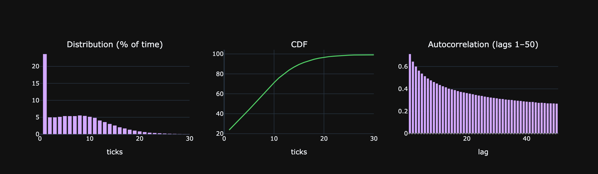

### 2.4 Spread statistics

```python
s     = lobs['spread_ticks']
s_bps = lobs['spread_bps']

stats = pd.DataFrame({'value': [
  f'{s.mean():.3f} ticks    ({s_bps.mean():.3f} bps)',
  f'{s.std():.3f} ticks',
  f'{s.median():.0f}  /  {s.quantile(0.75):.0f}  /  {s.quantile(0.90):.0f}  /  '
      f'{s.quantile(0.95):.0f}  /  {s.quantile(0.99):.0f}  /  {s.quantile(0.999):.0f}',
  f'{s.max()} ticks    ({s_bps.max():.1f} bps)',
  f'{s.skew():+.2f}',
  f'{s.kurtosis():+.2f}',
  f'{(s == 1).mean() * 100:.2f} %',
  f'{(s == 2).mean() * 100:.2f} %',
  f'{(s >= 5).mean()  * 100:.3f} %',
  f'{(s >= 10).mean() * 100:.4f} %',
  f'{(s >= 50).mean() * 100:.4f} %',
  f'{s.autocorr(1):+.3f}',
]}, index=[
  'Mean spread',
  'Std',
  'p50 / p75 / p90 / p95 / p99 / p99.9 (ticks)',
  'Max',
  'Skewness',
  'Excess kurtosis',
  '= 1 tick (% time)',
  '= 2 ticks',
  '≥ 5 ticks',
  '≥ 10 ticks',
  '≥ 50 ticks  (extreme dislocation)',
  'AR(1) of spread_ticks',
])
stats
```

**Result:**
```
                                                                            value
Mean spread                                            7.598 ticks    (0.873 bps)
Std                                                                   6.488 ticks
p50 / p75 / p90 / p95 / p99 / p99.9 (ticks)  7  /  11  /  16  /  19  /  27  /  47
Max                                                       354 ticks    (40.3 bps)
Skewness                                                                    +2.26
Excess kurtosis                                                            +31.59
= 1 tick (% time)                                                         23.65 %
= 2 ticks                                                                  5.02 %
≥ 5 ticks                                                                61.162 %
≥ 10 ticks                                                              34.0224 %
≥ 50 ticks  (extreme dislocation)                                        0.0838 %
AR(1) of spread_ticks                                                      +0.713
```

### 2.5 Returns — 1-second mid

```python
# Snapshot-to-snapshot returns; skip stale rows where mid didn't change
mid_seq  = lobs.sort_values('ts').set_index('ts')['mid']
ret_raw  = mid_seq.pct_change().dropna() * 1e4   # all intervals incl. stale
ret      = ret_raw[ret_raw != 0]                  # actual price moves only

zero_pct = (ret_raw == 0).mean() * 100
print(f'Stale (Δmid=0): {zero_pct:.1f}%  |  '
      f'Actual moves: {len(ret):,}  std={ret.std():.3f} bps  kurt={ret.kurtosis():.1f}')

X_CAP = 5   # bps
x_g   = np.linspace(-X_CAP, X_CAP, 500)

fig = make_subplots(rows=1, cols=2,
    subplot_titles=['Linear scale (central mass)', 'Log-Y scale (fat tails)'])

for col, use_log in [(1, False), (2, True)]:
    fig.add_trace(go.Histogram(
        x=ret.clip(-X_CAP, X_CAP), nbinsx=150, histnorm='probability density',
        name='Empirical', marker_color='#d2a8ff', opacity=0.75,
        showlegend=(col == 1)), row=1, col=col)
    fig.add_trace(go.Scatter(
        x=x_g, y=sps.norm.pdf(x_g, 0, ret.std()),
        mode='lines', name=f'Normal(σ={ret.std():.3f})',
        line=dict(color='#f0883e', width=2),
        showlegend=(col == 1)), row=1, col=col)
    if use_log:
        fig.update_yaxes(type='log', row=1, col=col)

fig.update_xaxes(title_text='Return (bps)')
fig.update_layout(
    template=THEME, height=360, barmode='overlay',
    title=f'Mid-price returns — actual moves only ({zero_pct:.1f}% stale removed)  |  clipped ±{X_CAP} bps')
show(fig)
```

**Output:**
```
Stale (Δmid=0): 65.4%  |  Actual moves: 269,441  std=0.782 bps  kurt=157.9
```

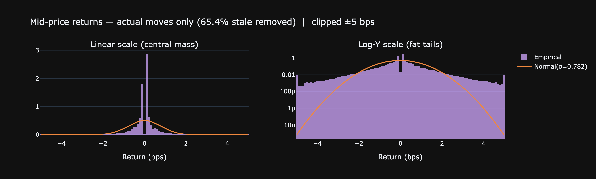

```python
# Absolute mid moves in ticks (same non-zero filter as above)
delta_raw   = lobs.sort_values('ts').set_index('ts')['mid'].diff().dropna()
delta_ticks = (delta_raw / TICK).round().astype(int)
delta_ticks = delta_ticks[delta_ticks != 0]

T_CAP = int(np.percentile(delta_ticks.abs(), 99))   # clip at p99 for readability
print(f'p50={delta_ticks.abs().median():.0f} ticks  '
      f'p95={np.percentile(delta_ticks.abs(), 95):.0f}  '
      f'p99={T_CAP:.0f}  max={delta_ticks.abs().max():.0f}')

x_g_t = np.linspace(-T_CAP, T_CAP, 500)
sigma_t = delta_ticks.std()

fig = make_subplots(rows=1, cols=2,
    subplot_titles=['Linear scale', 'Log-Y scale (fat tails)'])

for col, use_log in [(1, False), (2, True)]:
    fig.add_trace(go.Histogram(
        x=delta_ticks.clip(-T_CAP, T_CAP), nbinsx=min(2*T_CAP, 200),
        histnorm='probability density',
        name='Empirical', marker_color='#79c0ff', opacity=0.75,
        showlegend=(col == 1)), row=1, col=col)
    fig.add_trace(go.Scatter(
        x=x_g_t, y=sps.norm.pdf(x_g_t, 0, sigma_t),
        mode='lines', name=f'Normal(σ={sigma_t:.1f} ticks)',
        line=dict(color='#f0883e', width=2),
        showlegend=(col == 1)), row=1, col=col)
    if use_log:
        fig.update_yaxes(type='log', row=1, col=col)

fig.update_xaxes(title_text='Move (ticks, 1 tick = $0.001)')
fig.update_layout(
    template=THEME, height=360, barmode='overlay',
    title=f'Mid-price moves in ticks  (clipped at p99 = ±{T_CAP} ticks)')
show(fig)
```

**Output:**
```
p50=3 ticks  p95=16  p99=28  max=457
```

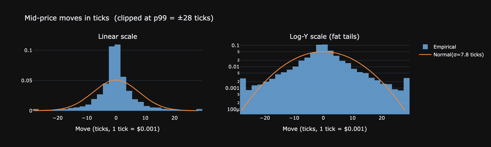

**Что показывают следующие два графика:**

- **QQ-plot** сравнивает квантили реальных возвратов с нормальным распределением: если бы цена была чистым гауссовым броуновским движением — точки лежали бы точно на диагонали. S-образное отклонение = тяжёлые хвосты (fat tails): экстремальные движения случаются намного чаще, чем предсказывает нормаль.
- **ACF(r) ≈ 0** — нет автокорреляции в самих возвратах: прошлое направление не предсказывает следующее (mid ≈ random walk на 1s-горизонте).
- **ACF(r²) значим** — кластеризация волатильности (ARCH-эффект): после крупного движения вероятность ещё одного крупного движения повышена. Для AS это означает, что статический параметр σ надо заменить на скользящий (exponentially-weighted), иначе стратегия будет котировать слишком узко в периоды высокой волатильности.

```python
# ret is computed above (non-zero snapshot-to-snapshot moves)

jb_stat, jb_p = sps.jarque_bera(ret)
print(f'1s returns: N={len(ret):,}  mean={ret.mean():+.3f} bps  std={ret.std():.3f} bps  '
      f'skew={ret.skew():+.2f}  kurt={ret.kurtosis():+.2f}  Jarque–Bera p={jb_p:.2e}')

# QQ-plot via quantile-based downsample (5k pts keeps plotly responsive)
N      = min(len(ret), 5000)
probs  = np.linspace(0.5/N, 1 - 0.5/N, N)
qq_y   = np.quantile(ret, probs)
qq_x   = sps.norm.ppf(probs) * ret.std() + ret.mean()

acf_r  = [ret.autocorr(k)        for k in range(1, 31)]
acf_r2 = [(ret**2).autocorr(k)   for k in range(1, 31)]
ci     = 1.96 / np.sqrt(len(ret))

fig = make_subplots(rows=1, cols=2, subplot_titles=[
    'QQ-plot vs Normal (in bps)', 'ACF: returns (purple) vs squared returns (orange)'])

fig.add_trace(go.Scatter(x=qq_x, y=qq_y, mode='markers',
                         marker=dict(color='#d2a8ff', size=3)), 1, 1)
lo, hi = qq_x.min(), qq_x.max()
fig.add_trace(go.Scatter(x=[lo, hi], y=[lo, hi], mode='lines',
                         line=dict(color='gray', dash='dash')), 1, 1)
fig.add_trace(go.Bar(x=list(range(1,31)), y=acf_r,  marker_color='#d2a8ff', name='r'),    1, 2)
fig.add_trace(go.Bar(x=list(range(1,31)), y=acf_r2, marker_color='#f0883e', name='r²',
                     opacity=0.6), 1, 2)
fig.add_hline(y= ci, line_dash='dot', line_color='gray', row=1, col=2)
fig.add_hline(y=-ci, line_dash='dot', line_color='gray', row=1, col=2)

fig.update_layout(template=THEME, height=350, showlegend=True)
show(fig)
```

**Output:**
```
1s returns: N=269,441  mean=+0.000 bps  std=0.782 bps  skew=+2.34  kurt=+157.87  Jarque–Bera p=0.00e+00
```

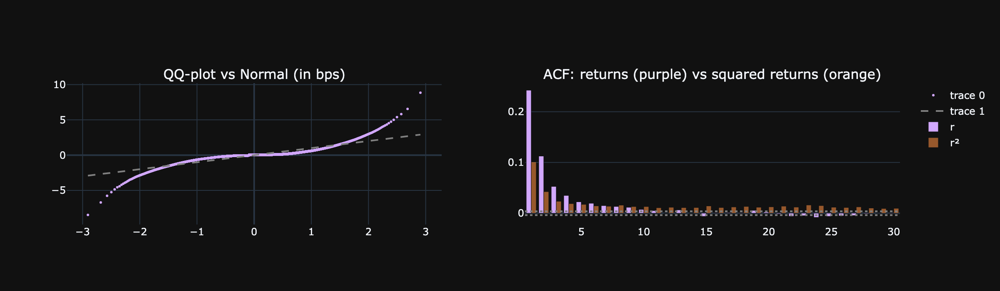

### 2.6 Realized volatility by timescale

Signature plot: σ rescaled to 1-second equivalent (σ_Δt / √Δt).
Flat line = Brownian motion. Down-sloping = mean reversion. Up-sloping = momentum/trending.

```python
scales = [('1s', 1), ('5s', 5), ('15s', 15), ('30s', 30), ('1min', 60), ('5min', 300)]
rows = []
for label, dt in scales:
    m = lobs.set_index('ts')['mid'].resample(label).last().ffill()
    r = m.pct_change().dropna() * 1e4
    rows.append({'scale': label, 'σ per bar (bps)': r.std(),
                 'σ per √sec (bps)': r.std() / np.sqrt(dt)})
sig = pd.DataFrame(rows)

fig = go.Figure()
fig.add_trace(go.Scatter(x=sig['scale'], y=sig['σ per √sec (bps)'],
    mode='lines+markers', line=dict(color='#d2a8ff'), marker=dict(size=10)))
fig.update_layout(template=THEME, height=300,
    title='σ per √second vs sampling scale  —  flat = Brownian',
    yaxis_title='bps / √sec')
show(fig)
sig.round(3)
```

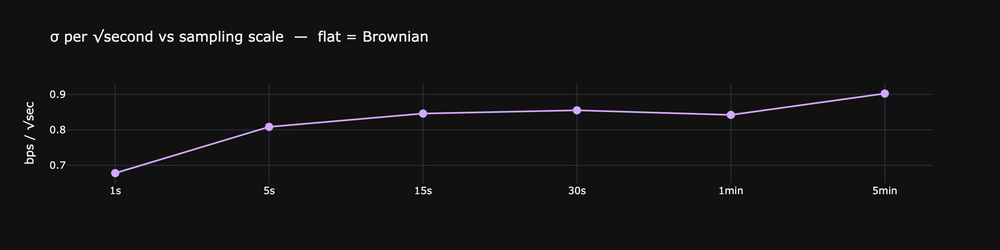

**Result:**
```
  scale  σ per bar (bps)  σ per √sec (bps)
0    1s            0.678             0.678
1    5s            1.808             0.809
2   15s            3.277             0.846
3   30s            4.685             0.855
4  1min            6.524             0.842
5  5min           15.630             0.902
```

## 3. Order book structure

### 3.1 Depth heatmap — first 5 minutes

```python
m5    = lobs[(lobs['ts'] >= T0) & (lobs['ts'] < T0 + pd.Timedelta('5min'))].iloc[::10].reset_index(drop=True)
n_s   = len(m5)
bid_v = np.array([[m5.loc[i, f'bid_sz_{l}'] for l in range(LEVELS)] for i in range(n_s)])
ask_v = np.array([[m5.loc[i, f'ask_sz_{l}'] for l in range(LEVELS)] for i in range(n_s)])
ts_lbl = m5['ts'].dt.strftime('%H:%M:%S').tolist()

# log-scale to compress big parked orders; bids negative on y-axis to mirror book
y_levels = list(range(-LEVELS, 0)) + list(range(1, LEVELS+1))
z        = np.hstack([np.log1p(bid_v[:, ::-1]), np.log1p(ask_v)]).T

fig = go.Figure(go.Heatmap(z=z, x=ts_lbl, y=y_levels, colorscale='Magma',
                           colorbar=dict(title='log(1+vol)')))
fig.update_layout(template=THEME, height=500,
    title='LOB depth (5 min, every 10th snapshot) — y<0: bids, y>0: asks',
    yaxis_title='level (signed)')
show(fig)
```

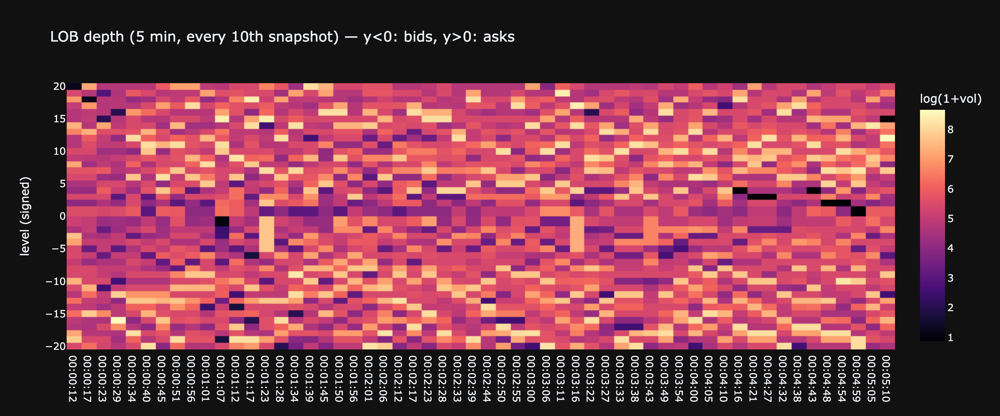

### 3.2 L1 imbalance and microprice

```python
# Correlation: imbalance now → next-snapshot mid change. Computed on full data.
mid_chg = lobs['mid'].diff().shift(-1)
corr    = lobs['imb'].corr(mid_chg)

fig = make_subplots(rows=2, cols=1, shared_xaxes=True,
    subplot_titles=[f'Microprice vs mid (30-min slice)',
                    f'L1 imbalance — corr(imb_t, Δmid_{{t+1}}) = {corr:+.3f} on full data'])

fig.add_trace(go.Scatter(x=lob30['ts'], y=lob30['mid'],        name='mid',
                         line=dict(color='#d2a8ff', width=1.2)), 1, 1)
fig.add_trace(go.Scatter(x=lob30['ts'], y=lob30['microprice'], name='microprice',
                         line=dict(color='#f0883e', width=1.0, dash='dot')), 1, 1)
fig.add_trace(go.Scatter(x=lob30['ts'], y=lob30['imb'], name='imbalance',
                         line=dict(color='#51cf66', width=0.6),
                         fill='tozeroy', fillcolor='rgba(81,207,102,0.10)'), 2, 1)
fig.update_yaxes(range=[-1, 1], row=2, col=1)
fig.update_layout(template=THEME, height=550, showlegend=True)
show(fig)
```

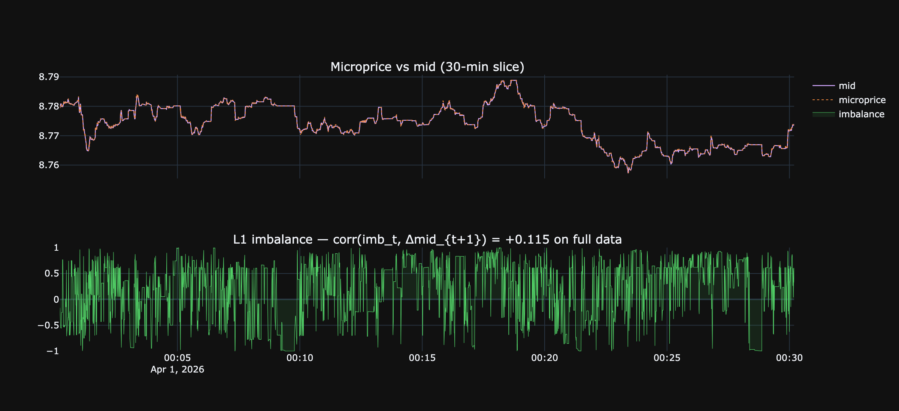

### 3.3 Intraday profile

Activity (trades/min) and mid-volatility (5-min bars), averaged across all loaded days by minute-of-day.
Reveals daily seasonality — typical US/EU session peaks.

```python
n_days = lobs['ts'].dt.date.nunique()

# trades/min per minute-of-day, averaged across days
tx = taker.copy()
tx['mod'] = tx['ts'].dt.hour * 60 + tx['ts'].dt.minute
activity  = tx.groupby('mod').size() / n_days

# σ per 5-min bar, by 5-min bucket of the day
lobs['bucket5'] = ((lobs['ts'].dt.hour*60 + lobs['ts'].dt.minute) // 5) * 5
mid_chg_bps     = lobs['mid'].pct_change() * 1e4
vol_5m          = mid_chg_bps.groupby(lobs['bucket5']).std()

fig = make_subplots(rows=2, cols=1, shared_xaxes=True,
    subplot_titles=['Trades / minute (avg across days)',
                    'σ (bps) by 5-min bucket of day'])
fig.add_trace(go.Bar(x=activity.index, y=activity.values, marker_color='#d2a8ff'), 1, 1)
fig.add_trace(go.Scatter(x=vol_5m.index, y=vol_5m.values, mode='lines',
                         line=dict(color='#f0883e')), 2, 1)
fig.update_xaxes(title_text='minute of day (UTC)', row=2, col=1)
fig.update_layout(template=THEME, height=500, showlegend=False)
show(fig)
```

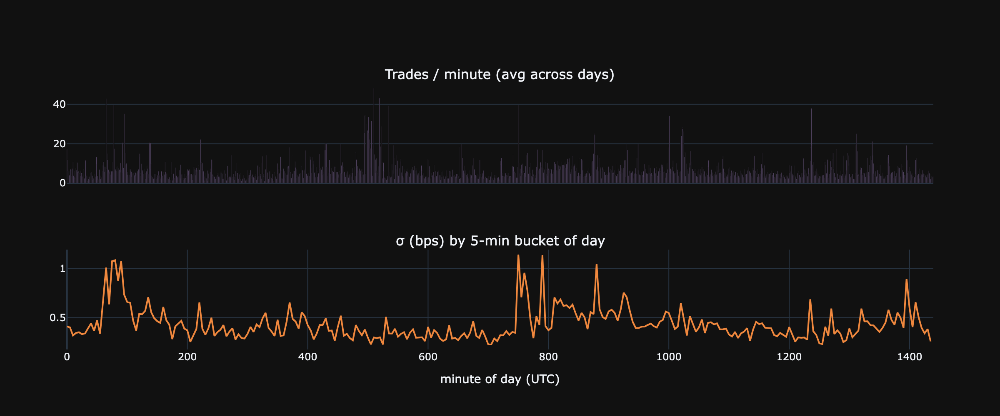

## 4. Trade analysis

### 4.1 Overview

```python
dur_s   = (taker['ts'].max() - taker['ts'].min()).total_seconds()
n_buy   = (taker['agg']=='buy').sum()
n_sell  = (taker['agg']=='sell').sum()
v_buy   = taker.loc[taker['agg']=='buy',  'sz'].sum()
v_sell  = taker.loc[taker['agg']=='sell', 'sz'].sum()

t_overview = pd.DataFrame({'value': [
    f'{len(taker):,}',
    f'{len(taker)/dur_s:.2f} /sec   ({len(taker)/dur_s*60:.0f} /min)',
    f'{n_buy:,}  ({n_buy/len(taker)*100:.1f}%)',
    f'{n_sell:,}  ({n_sell/len(taker)*100:.1f}%)',
    f'{taker["sz"].sum():,.0f} {ASSET_NAME}',
    f'{v_buy:,.0f} {ASSET_NAME}  ({v_buy/(v_buy+v_sell)*100:.1f}%)',
    f'{v_sell:,.0f} {ASSET_NAME}  ({v_sell/(v_buy+v_sell)*100:.1f}%)',
    f'mean {taker["sz"].mean():.2f}   median {taker["sz"].median():.2f}   p99 {taker["sz"].quantile(0.99):.1f}',
]}, index=['Trades', 'Rate', 'Buys', 'Sells', 'Total volume', 'Buy volume', 'Sell volume', 'Trade size ({ASSET_NAME})'])
t_overview
```

**Result:**
```
                                                           value
Trades                                                    45,723
Rate                                        0.11 /sec   (6 /min)
Buys                                             25,354  (55.5%)
Sells                                            20,369  (44.5%)
Total volume                                      2,285,725 LINK
Buy volume                               1,090,066 LINK  (47.7%)
Sell volume                              1,195,659 LINK  (52.3%)
Trade size ({ASSET_NAME})  mean 49.99   median 16.40   p99 554.7
```

### 4.2 Trade size distribution

```python
LIN_BIN = 0.5   # bucket width for linear-scale panel

log_buy  = np.log10(taker.loc[taker['agg']=='buy',  'sz'].clip(lower=0.01))
log_sell = np.log10(taker.loc[taker['agg']=='sell', 'sz'].clip(lower=0.01))
bins     = np.linspace(min(log_buy.min(), log_sell.min()),
                     max(log_buy.max(), log_sell.max()), 60)

bc, _ = np.histogram(log_buy,  bins=bins, density=True)
sc, _ = np.histogram(log_sell, bins=bins, density=True)
xc    = 0.5 * (bins[:-1] + bins[1:])

sz_buy  = taker.loc[taker['agg']=='buy',  'sz']
sz_sell = taker.loc[taker['agg']=='sell', 'sz']
lin_cap = np.percentile(taker['sz'], 80)
lin_bins = np.arange(0, lin_cap + LIN_BIN, LIN_BIN)

bc2, _ = np.histogram(sz_buy.clip(upper=lin_cap),  bins=lin_bins, density=True)
sc2, _ = np.histogram(sz_sell.clip(upper=lin_cap), bins=lin_bins, density=True)
xc2    = 0.5 * (lin_bins[:-1] + lin_bins[1:])

fig = make_subplots(rows=1, cols=2,
  subplot_titles=['Log10 scale', f'Linear scale (bin={LIN_BIN} {ASSET_NAME}, clipped p80={lin_cap:.1f})'])

fig.add_trace(go.Bar(x=xc,  y=bc,  name='buy',  marker_color='#51cf66', opacity=0.6), 1, 1)
fig.add_trace(go.Bar(x=xc,  y=sc,  name='sell', marker_color='#ff6b6b', opacity=0.6), 1, 1)
fig.add_trace(go.Bar(x=xc2, y=bc2, name='buy',  marker_color='#51cf66', opacity=0.6, showlegend=False), 1, 2)
fig.add_trace(go.Bar(x=xc2, y=sc2, name='sell', marker_color='#ff6b6b', opacity=0.6, showlegend=False), 1, 2)

fig.update_xaxes(title_text='log10(size)', row=1, col=1)
fig.update_xaxes(title_text=f'size ({ASSET_NAME})',  row=1, col=2)
fig.update_layout(template=THEME, barmode='overlay', height=380,
  title='Trade size distribution — buy vs sell')
show(fig)
```

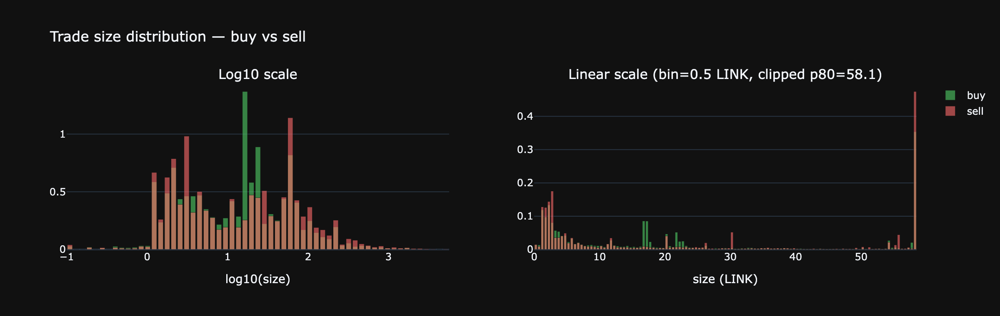

### 4.3 Price impact

For each taker fill: `mid_after − mid_before` in ticks, signed by aggressor direction.
Uses `merge_asof` to find the LOB snapshot just before and just after each trade.

```python
tx = taker.sort_values('ts')[['ts', 'agg', 'sz']].reset_index(drop=True)
lb = lobs.sort_values('ts')[['ts', 'mid']].reset_index(drop=True)

before = pd.merge_asof(tx, lb.rename(columns={'ts':'ts_b','mid':'mid_b'}),
                       left_on='ts', right_on='ts_b', direction='backward')
after  = pd.merge_asof(tx, lb.rename(columns={'ts':'ts_a','mid':'mid_a'}),
                       left_on='ts', right_on='ts_a', direction='forward')

imp = before[['agg','sz']].copy()
imp['mid_b'] = before['mid_b']
imp['mid_a'] = after['mid_a']
imp = imp.dropna()
imp['ticks']        = (imp['mid_a'] - imp['mid_b']) / TICK
imp['signed_ticks'] = np.where(imp['agg']=='buy', imp['ticks'], -imp['ticks'])
imp['log_sz']       = np.log10(imp['sz'].clip(lower=0.01))

# avg signed impact in 8 size buckets
imp['bucket'] = pd.cut(imp['log_sz'], bins=8)
agg = imp.groupby('bucket', observed=True)['signed_ticks'].agg(['mean','std','count'])
agg['x'] = [b.mid for b in agg.index]

fig = make_subplots(rows=1, cols=2, subplot_titles=[
    f'Signed impact (ticks) — mean = {imp["signed_ticks"].mean():+.3f}',
    'Avg signed impact vs trade size'])

clip = imp['signed_ticks'].clip(*np.quantile(imp['signed_ticks'], [0.005, 0.995]))
fig.add_trace(go.Histogram(x=clip, nbinsx=80, marker_color='#d2a8ff'), 1, 1)
fig.add_trace(go.Scatter(x=agg['x'], y=agg['mean'], mode='lines+markers',
                         error_y=dict(array=agg['std']/np.sqrt(agg['count'])),
                         line=dict(color='#f0883e')), 1, 2)
fig.update_xaxes(title_text='ticks',       row=1, col=1)
fig.update_xaxes(title_text='log10(size)', row=1, col=2)
fig.update_layout(template=THEME, height=350, showlegend=False)
show(fig)
```

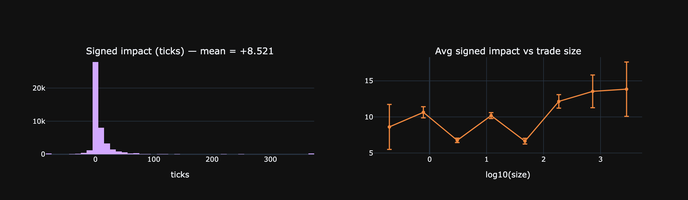

### 4.4 Inter-arrival times — distribution of Δt between consecutive trades

How much time passes between two consecutive taker fills? Three complementary views:
- **Linear PDF (clipped at p99)** — shape of the bulk (where most Δt live).
- **PDF over log₁₀(Δt)** — full range from ms-bursts to second-long gaps; reveals multimodality if the process has distinct regimes (active vs quiet).
- **Survival 1−CDF on log-log** — distribution family test. Exponential (memoryless Poisson) is a straight line on **semi-log y**. A heavier tail (curve up) means long pauses are more frequent than Poisson predicts → activity is bursty/clustered.

```python
ia     = taker['ts'].sort_values().diff().dt.total_seconds().dropna() * 1000  # ms
lam_ms = 1.0 / ia.mean()       # rate in 1/ms
lam_s  = lam_ms * 1000          # rate per second (≈ trades/sec)

# Rich percentile table — focuses purely on the Δt distribution
stats_44 = pd.DataFrame({'value': [
    f'{len(ia):,}',
    f'{ia.mean():.1f} ms      (λ̂ = {lam_s:.2f} trades/sec)',
    f'{ia.std():.1f} ms',
    f'{ia.quantile(0.10):.1f} ms',
    f'{ia.quantile(0.50):.1f} ms',
    f'{ia.quantile(0.90):.0f} ms',
    f'{ia.quantile(0.99):.0f} ms',
    f'{ia.quantile(0.999):.0f} ms  ({ia.quantile(0.999)/1000:.2f} s)',
    f'{ia.max():.0f} ms  ({ia.max()/1000:.1f} s)',
    f'{(ia < 50).mean()*100:.2f} %',
    f'{(ia > 1000).mean()*100:.2f} %',
    f'{(ia > 10000).mean()*100:.4f} %',
]}, index=[
    'Count', 'Mean Δt', 'Std',
    'p10', 'p50 (median)', 'p90', 'p99', 'p99.9', 'Max',
    'Δt < 50 ms (back-to-back bursts)',
    'Δt > 1 sec  (notable gaps)',
    'Δt > 10 sec (rare lulls)',
])
print(stats_44.to_string())

# Panel 1: linear PDF clipped at p99 — bulk shape
p99       = ia.quantile(0.99)
clip      = ia.clip(upper=p99)
c1, e1    = np.histogram(clip, bins=80, density=True)
x1        = 0.5 * (e1[:-1] + e1[1:])
x_exp     = np.linspace(0, p99, 200)
y_exp     = lam_ms * np.exp(-lam_ms * x_exp)

# Panel 2: PDF over log10(Δt) — full range across magnitudes
log_ia    = np.log10(ia.clip(lower=1))   # clip to ≥1 ms to avoid log(0)
c2, e2    = np.histogram(log_ia, bins=60, density=True)
x2        = 0.5 * (e2[:-1] + e2[1:])

# Panel 3: survival 1-CDF on log-log — distribution-family test
sorted_ia = np.sort(ia.values)
surv      = 1 - np.arange(1, len(sorted_ia) + 1) / len(sorted_ia)
idx       = np.linspace(0, len(sorted_ia) - 2, 1000).astype(int)
sx, sy    = sorted_ia[idx], surv[idx]
sy_exp    = np.exp(-lam_ms * sx)

fig = make_subplots(rows=1, cols=3, subplot_titles=[
    f'Linear PDF  (clipped at p99 = {p99:.0f} ms)',
    'PDF on log₁₀(Δt) — full range',
    'Survival 1−CDF (log-log) — straight on semi-log = exponential',
])
fig.add_trace(go.Bar(x=x1, y=c1, name='empirical', marker_color='#d2a8ff'), 1, 1)
fig.add_trace(go.Scatter(x=x_exp, y=y_exp, name=f'Exp(λ̂)',
                         line=dict(color='#f0883e')), 1, 1)
fig.add_trace(go.Bar(x=x2, y=c2, marker_color='#d2a8ff', showlegend=False), 1, 2)
fig.add_trace(go.Scatter(x=sx, y=sy, line=dict(color='#d2a8ff'),
                         name='empirical', showlegend=False), 1, 3)
fig.add_trace(go.Scatter(x=sx, y=sy_exp, line=dict(color='#f0883e', dash='dot'),
                         name='Exp ref', showlegend=False), 1, 3)

fig.update_xaxes(title_text='Δt (ms)',         row=1, col=1)
fig.update_xaxes(title_text='log₁₀(Δt, ms)',   row=1, col=2)
fig.update_xaxes(title_text='Δt (ms)', type='log', row=1, col=3)
fig.update_yaxes(type='log', row=1, col=3)
fig.update_layout(template=THEME, height=380, showlegend=True)
show(fig)
```

**Output:**
```
                                                                  value
Count                                                            45,722
Mean Δt                           9448.2 ms      (λ̂ = 0.11 trades/sec)
Std                                                          16698.0 ms
p10                                                              0.0 ms
p50 (median)                                                  1716.0 ms
p90                                                            29986 ms
p99                                                            78770 ms
p99.9                                             111483 ms  (111.48 s)
Max                                                222214 ms  (222.2 s)
Δt < 50 ms (back-to-back bursts)                                30.96 %
Δt > 1 sec  (notable gaps)                                      54.52 %
Δt > 10 sec (rare lulls)                                      26.9695 %
```

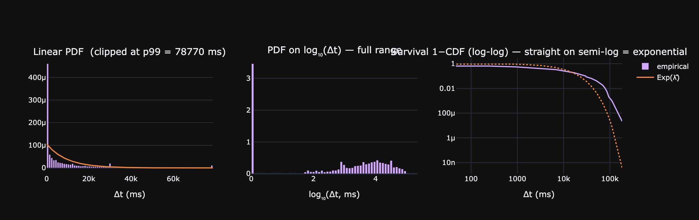

### 4.5 Zoom: 0–500 ms

Большая часть массы Δt сидит в самой левой коробке предыдущего графика. Здесь видно тонкую структуру — пики на конкретных задержках, refractory-эффект сразу после трейда, реальную форму распадающегося пика.

```python
# Multi-leg market orders дают N taker-строк с одним time_ms → Δt = 0 между ними.
# Свёртываем по time_ms: одно событие = один матчинг-момент (независимо от числа legs).
events_ts = taker['ts'].drop_duplicates().sort_values()
ia2       = events_ts.diff().dt.total_seconds().dropna() * 1000  # ms

print(f'Taker legs: {len(taker):,}   →   unique events (by time_ms): {len(events_ts):,}'
      f'   ({len(events_ts)/len(taker)*100:.1f}% — остальное — legs внутри одного MO)')

lam_ms2 = 1.0 / ia2.mean()
lam_s2  = lam_ms2 * 1000

ZOOM_MAX = 500   # ms
BIN      = 1     # ms

bins      = np.arange(0, ZOOM_MAX + BIN, BIN)
ia_zoom   = ia2[ia2 <= ZOOM_MAX]
counts, _ = np.histogram(ia_zoom, bins=bins, density=True)
centers   = 0.5 * (bins[:-1] + bins[1:])

y_exp = lam_ms2 * np.exp(-lam_ms2 * centers)

share_in_zoom = (ia2 <= ZOOM_MAX).mean() * 100
print(f'{share_in_zoom:.2f}% of event Δt fall into [0, {ZOOM_MAX}] ms  '
      f'(N = {len(ia_zoom):,})  λ̂_events = {lam_s2:.2f}/sec')

fig = go.Figure()
fig.add_trace(go.Bar(x=centers, y=counts, marker_color='#d2a8ff',
                     name=f'empirical ({BIN} ms bins)'))
fig.add_trace(go.Scatter(x=centers, y=y_exp, line=dict(color='#f0883e'),
                         name=f'Exp(λ̂={lam_s2:.1f}/s)'))
fig.update_layout(template=THEME, height=400,
    title=f'Inter-event Δt PDF (deduped by time_ms), 0–{ZOOM_MAX} ms, {BIN} ms bins',
    xaxis_title='Δt (ms)', yaxis_title='density')
show(fig)
```

**Output:**
```
Taker legs: 45,723   →   unique events (by time_ms): 31,614   (69.1% — остальное — legs внутри одного MO)
11.22% of event Δt fall into [0, 500] ms  (N = 3,547)  λ̂_events = 0.07/sec
```

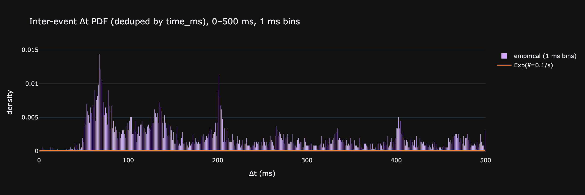

## 5. Data quality

### 5.1 LOB snapshot cadence

С какой частотой биржа отдаёт snapshot стакана? Есть ли длинные «слепые» паузы?

```python
dt = lobs['time_ms'].diff().dropna()

stats = pd.DataFrame({'value': [
    f'{dt.median():.0f} ms',
    f'{dt.mean():.0f} ms',
    f'{dt.quantile(0.90):.0f} ms',
    f'{dt.quantile(0.99):.0f} ms',
    f'{dt.max():.0f} ms  ({dt.max()/1000:.1f} s)',
    f'{(dt > 1000).mean()*100:.3f} %',
    f'{(dt > 10000).mean()*100:.4f} %',
]}, index=['Median Δt', 'Mean Δt', 'p90', 'p99', 'Max gap',
          'Δt > 1 sec', 'Δt > 10 sec'])
print(stats.to_string())

clip          = dt.clip(upper=dt.quantile(0.999))
counts, edges = np.histogram(clip, bins=80, density=True)
centers       = 0.5 * (edges[:-1] + edges[1:])

sorted_dt = np.sort(dt.values)
surv      = 1 - np.arange(1, len(sorted_dt)+1) / len(sorted_dt)
idx       = np.linspace(0, len(sorted_dt)-2, 1000).astype(int)

fig = make_subplots(rows=1, cols=2, subplot_titles=[
    'Snapshot Δt PDF (clipped at p99.9)',
    'Survival 1−CDF (log-y)'])
fig.add_trace(go.Bar(x=centers, y=counts, marker_color='#d2a8ff'), 1, 1)
fig.add_trace(go.Scatter(x=sorted_dt[idx], y=surv[idx],
                         line=dict(color='#d2a8ff')), 1, 2)
fig.update_xaxes(title_text='Δt (ms)', row=1, col=1)
fig.update_xaxes(title_text='Δt (ms)', row=1, col=2)
fig.update_yaxes(type='log', row=1, col=2)
fig.update_layout(template=THEME, height=350, showlegend=False)
show(fig)
```

**Output:**
```
                            value
Median Δt                  537 ms
Mean Δt                    555 ms
p90                        574 ms
p99                        620 ms
Max gap      404902 ms  (404.9 s)
Δt > 1 sec                0.018 %
Δt > 10 sec              0.0104 %
```

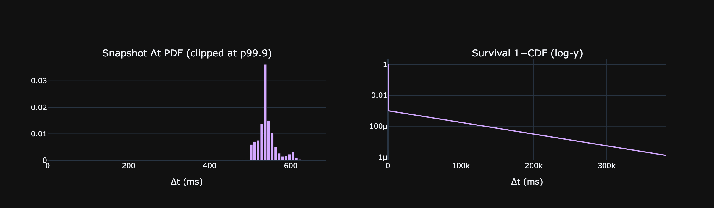

### 5.2 Trade-to-snapshot lag

Для каждого трейда — расстояние до **ближайшего** LOB-снапшота (вперёд или назад). Это floor на точность реконструкции состояния книги в момент трейда.

```python
tx = taker[['ts']].sort_values('ts').reset_index(drop=True)
lb = lobs[['ts']].sort_values('ts').reset_index(drop=True)

before   = pd.merge_asof(tx, lb.rename(columns={'ts':'ts_b'}),
                         left_on='ts', right_on='ts_b', direction='backward')
after    = pd.merge_asof(tx, lb.rename(columns={'ts':'ts_a'}),
                         left_on='ts', right_on='ts_a', direction='forward')
lag_back = (tx['ts'] - before['ts_b']).dt.total_seconds() * 1000
lag_fwd  = (after['ts_a'] - tx['ts']).dt.total_seconds() * 1000
lag_min  = pd.concat([lag_back, lag_fwd], axis=1).min(axis=1).dropna()

stats = pd.DataFrame({'value': [
    f'{lag_min.median():.0f} ms',
    f'{lag_min.mean():.0f} ms',
    f'{lag_min.quantile(0.90):.0f} ms',
    f'{lag_min.quantile(0.99):.0f} ms',
    f'{lag_min.max():.0f} ms',
]}, index=['Median', 'Mean', 'p90', 'p99', 'Max'])
print(stats.to_string())

clip          = lag_min.clip(upper=lag_min.quantile(0.97))
counts, edges = np.histogram(clip, bins=80, density=True)
centers       = 0.5 * (edges[:-1] + edges[1:])

fig = go.Figure()
fig.add_trace(go.Bar(x=centers, y=counts, marker_color='#d2a8ff', name='lag'))
fig.update_layout(template=THEME, height=320,
    title=f'Trade → nearest snapshot (clipped at p97 = {lag_min.quantile(0.97):.0f} ms)',
    xaxis_title='ms', yaxis_title='density')
show(fig)
```

**Output:**
```
            value
Median     134 ms
Mean      2514 ms
p90        259 ms
p99     104808 ms
Max     192236 ms
```

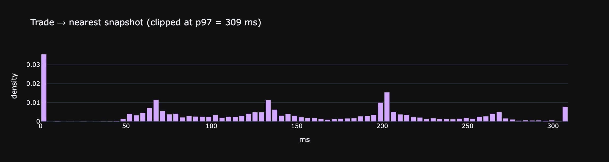

## 6. Order book microstructure

### 6.1 Aggregate depth profile

Усреднённые `sz` (объём в SYMBOL) и `n` (число ордеров) по каждому из 20 уровней. Где сидит реальная масса ликвидности — у L1 или в глубине?

```python
levels = list(range(LEVELS))
prof   = pd.DataFrame({
    'level':  levels,
    'bid_sz': [lobs[f'bid_sz_{i}'].mean() for i in levels],
    'ask_sz': [lobs[f'ask_sz_{i}'].mean() for i in levels],
    'bid_n':  [lobs[f'bid_n_{i}'].mean()  for i in levels],
    'ask_n':  [lobs[f'ask_n_{i}'].mean()  for i in levels],
})
prof['avg_order_bid'] = prof['bid_sz'] / prof['bid_n']
prof['avg_order_ask'] = prof['ask_sz'] / prof['ask_n']

fig = make_subplots(rows=2, cols=1, shared_xaxes=True, row_heights=[0.5, 0.5],
    subplot_titles=[f'Avg size per level ({ASSET_NAME}) — bids vs asks',
                    'Avg # of orders per level'])
fig.add_trace(go.Bar(x=prof['level'], y=-prof['bid_sz'], name='bid sz',
                    marker_color='#51cf66'), 1, 1)
fig.add_trace(go.Bar(x=prof['level'], y= prof['ask_sz'], name='ask sz',
                    marker_color='#ff6b6b'), 1, 1)
fig.add_trace(go.Bar(x=prof['level'], y=-prof['bid_n'], name='bid n',
                    marker_color='#51cf66', showlegend=False), 2, 1)
fig.add_trace(go.Bar(x=prof['level'], y= prof['ask_n'], name='ask n',
                    marker_color='#ff6b6b', showlegend=False), 2, 1)
fig.update_xaxes(title_text='level (0 = best)', row=2, col=1)
fig.update_layout(template=THEME, height=550, showlegend=True)
show(fig)

prof.round(2)
```

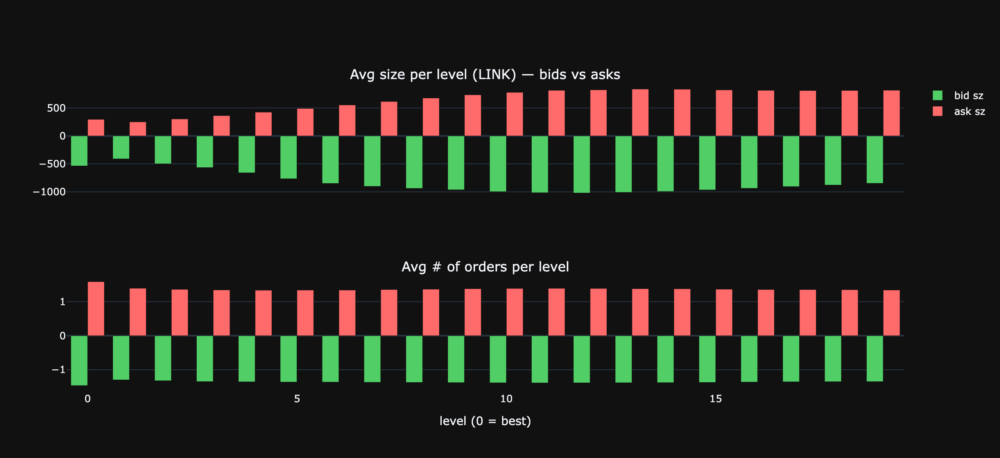

**Result:**
```
    level   bid_sz  ask_sz  bid_n  ask_n  avg_order_bid  avg_order_ask
0       0   537.77  296.37   1.46   1.59         367.08         186.63
1       1   411.86  251.40   1.30   1.40         317.44         180.21
2       2   499.41  303.28   1.32   1.36         377.92         222.75
3       3   566.32  363.41   1.35   1.35         419.96         270.19
4       4   660.71  426.46   1.35   1.34         487.81         319.09
5       5   766.50  491.54   1.36   1.34         562.92         366.92
6       6   851.34  554.48   1.36   1.34         624.37         413.90
7       7   903.69  615.93   1.37   1.36         660.91         454.14
8       8   939.73  679.20   1.37   1.37         684.29         497.11
9       9   964.95  735.44   1.38   1.38         700.41         532.82
10     10   997.91  779.84   1.38   1.39         721.56         562.15
11     11  1017.30  816.37   1.39   1.39         732.97         586.49
12     12  1022.22  824.62   1.38   1.39         738.42         594.52
13     13  1011.05  838.94   1.38   1.38         731.96         607.29
14     14   994.72  836.66   1.38   1.38         721.59         607.43
15     15   966.40  823.57   1.37   1.37         703.96         603.28
16     16   937.88  815.83   1.36   1.36         688.20         601.40
17     17   906.88  812.85   1.35   1.36         669.71         599.87
18     18   879.48  814.56   1.35   1.35         650.63         603.50
19     19   848.62  817.56   1.35   1.34         629.06         609.48
```

### 6.2 Queue length at L1

Сколько ордеров стоит на лучшем уровне и какого они размера. `n` уникален для HL — на CEX feed обычно не доступен.

```python
n1     = lobs['bid_n_0'].combine(lobs['ask_n_0'], func=max)  # take both sides
n_bid  = lobs['bid_n_0']
n_ask  = lobs['ask_n_0']
sz_per_order_bid = lobs['bid_sz_0'] / lobs['bid_n_0']
sz_per_order_ask = lobs['ask_sz_0'] / lobs['ask_n_0']

stats = pd.DataFrame({
    'bid L1': [n_bid.median(), n_bid.mean(), n_bid.quantile(0.99), n_bid.max(),
               sz_per_order_bid.median()],
    'ask L1': [n_ask.median(), n_ask.mean(), n_ask.quantile(0.99), n_ask.max(),
               sz_per_order_ask.median()],
}, index=['median # orders', 'mean # orders', 'p99 # orders', 'max # orders',
         f'median order sz ({ASSET_NAME})']).round(2)
print(stats.to_string())

# Joint distribution of bid_n_0 (capped for plotting)
n_cap = 30
bid_hist = n_bid.clip(upper=n_cap).value_counts(normalize=True).sort_index()
ask_hist = n_ask.clip(upper=n_cap).value_counts(normalize=True).sort_index()

fig = go.Figure()
fig.add_trace(go.Bar(x=bid_hist.index, y=bid_hist.values*100, name='bid L1',
                    marker_color='#51cf66', opacity=0.6))
fig.add_trace(go.Bar(x=ask_hist.index, y=ask_hist.values*100, name='ask L1',
                    marker_color='#ff6b6b', opacity=0.6))
fig.update_layout(template=THEME, barmode='overlay', height=320,
    title=f'Distribution of # orders at L1 (capped at {n_cap})',
    xaxis_title='# orders', yaxis_title='% of snapshots')
show(fig)
```

**Output:**
```
                        bid L1  ask L1
median # orders           1.00    1.00
mean # orders             1.46    1.59
p99 # orders              5.00    5.00
max # orders             23.00   57.00
median order sz (LINK)  222.30   66.10
```

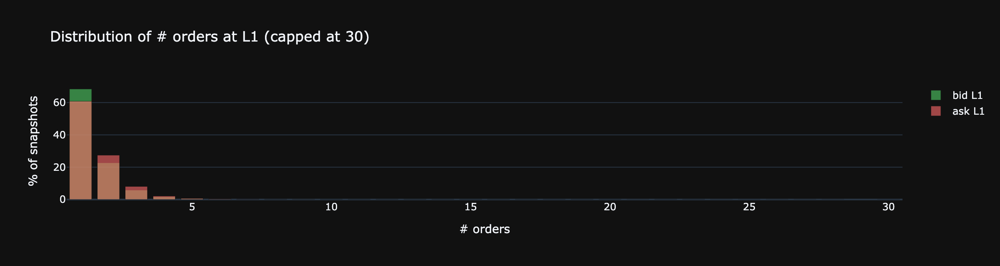

### 6.3 Top-of-book churn

Как часто меняется лучшая цена? Распределение времени жизни L1.

```python
bid_changed = lobs['bid_px_0'].diff() != 0
ask_changed = lobs['ask_px_0'].diff() != 0
either      = bid_changed | ask_changed

print(f'% snapshots where best bid changed: {bid_changed.mean()*100:.2f}%')
print(f'% snapshots where best ask changed: {ask_changed.mean()*100:.2f}%')
print(f'% snapshots where either changed:   {either.mean()*100:.2f}%')

# Lifetime of best bid: ms between consecutive changes
bid_runs    = bid_changed.cumsum()
bid_runtime = lobs.groupby(bid_runs)['time_ms'].agg(['first','last'])
bid_life_ms = (bid_runtime['last'] - bid_runtime['first']).iloc[1:]   # drop initial run

ask_runs    = ask_changed.cumsum()
ask_runtime = lobs.groupby(ask_runs)['time_ms'].agg(['first','last'])
ask_life_ms = (ask_runtime['last'] - ask_runtime['first']).iloc[1:]

life = pd.concat([bid_life_ms, ask_life_ms])

stats = pd.DataFrame({'value': [
    f'{life.median():.0f} ms',
    f'{life.mean():.0f} ms',
    f'{life.quantile(0.90):.0f} ms',
    f'{life.quantile(0.99):.0f} ms',
    f'{life.max()/1000:.1f} s',
]}, index=['Median lifetime', 'Mean', 'p90', 'p99', 'Max'])
print()
stats
```

**Output:**
```
% snapshots where best bid changed: 25.48%
% snapshots where best ask changed: 21.06%
% snapshots where either changed:   35.18%
```

**Result:**
```
                    value
Median lifetime      0 ms
Mean              1784 ms
p90               4427 ms
p99              23929 ms
Max               250.6 s
```

```python
BIN_MS = 10   # ms per bucket

p95   = life.quantile(0.90)
edges = np.arange(0, p95 + BIN_MS, BIN_MS)
clip  = life.clip(upper=p95)

counts, edges = np.histogram(clip, bins=edges, density=True)
centers       = 0.5 * (edges[:-1] + edges[1:])

fig = go.Figure()
fig.add_trace(go.Bar(x=centers, y=counts, marker_color='#d2a8ff', width=BIN_MS * 0.9))
fig.update_layout(template=THEME, height=320,
  title=f'Lifetime of best bid/ask  (bin={BIN_MS} ms, clipped p95 = {p95:.0f} ms)',
  xaxis_title='ms', yaxis_title='density')
show(fig)
```

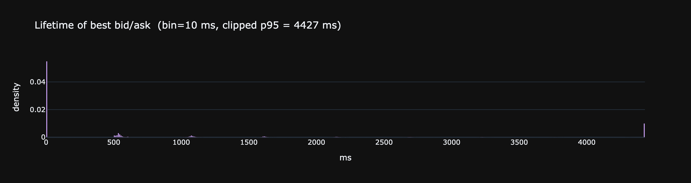

### 6.4 Where trades happen relative to mid

Для каждого трейда — на каком расстоянии от mid он случился. По сути descriptive λ(δ): сколько массы трейдов сидит на L1 и сколько уходит вглубь книги.

```python
tx = taker[['ts','agg','sz','px']].sort_values('ts').reset_index(drop=True)
lb = lobs[['ts','mid','bid_px_0','ask_px_0']].sort_values('ts').reset_index(drop=True)
m  = pd.merge_asof(tx, lb, on='ts', direction='backward').dropna()

# Depth into book = how far past best touch did the aggressor reach (in ticks).
# 0 = filled at L1, 1+ = walked through book.
m['depth_ticks'] = np.where(
    m['agg']=='buy',
    (m['px'] - m['ask_px_0']) / TICK,
    (m['bid_px_0'] - m['px']) / TICK,
).round(0).astype(int)

# Stats
share = m.groupby('depth_ticks').size() / len(m) * 100

cap = 20
hist = m['depth_ticks'].clip(lower=-cap, upper=cap).value_counts(normalize=True).sort_index()

fig = go.Figure()
fig.add_trace(go.Bar(x=hist.index, y=hist.values*100, marker_color='#d2a8ff'))
fig.update_layout(template=THEME, height=320,
    title=f'Trade depth past L1 (ticks, capped at {cap})',
    xaxis_title='ticks past L1 (0 = fill at touch)',
    yaxis_title='% of trades')
show(fig)
```

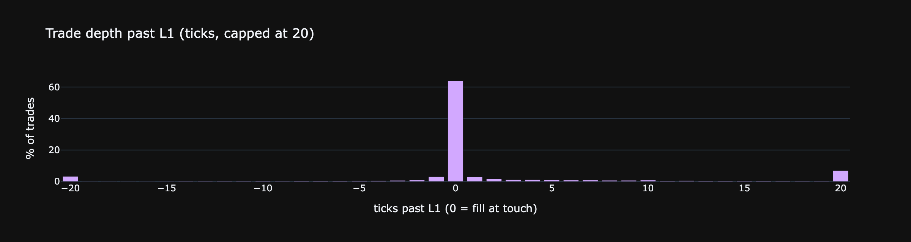

## 7. Price dynamics over short horizons

### 7.1 Mid drift at multiple horizons

Распределение `log(mid(t+Δt) / mid(t))` в bps для нескольких Δt. Брауновское движение → std∝√Δt. Если на коротких Δt дисперсия меньше предсказанной — есть mean-reversion.

```python
mid_grid = lobs.set_index('ts')['mid'].resample('1s').last().ffill()
horizons = [(1,'1s'), (5,'5s'), (15,'15s'), (60,'1min'), (300,'5min')]

rows = []
drifts_bps   = {}
drifts_ticks = {}
for k, label in horizons:
    bps   = (np.log(mid_grid.shift(-k)) - np.log(mid_grid)).dropna() * 1e4
    ticks = (mid_grid.shift(-k) - mid_grid).dropna() / TICK
    drifts_bps[label]   = bps
    drifts_ticks[label] = ticks
    rows.append({'horizon': label, 'σ bps': round(bps.std(), 3),
                 'σ ticks': round(ticks.std(), 1),
                 'p99 bps': round(bps.quantile(0.99), 2),
                 'p99 ticks': round(ticks.quantile(0.99), 1)})
pd.DataFrame(rows)
```

**Result:**
```
  horizon   σ bps  σ ticks  p99 bps  p99 ticks
0      1s   0.678      5.9     2.17       19.0
1      5s   1.786     15.6     5.40       47.0
2     15s   3.264     28.6     9.17       80.0
3    1min   6.641     58.2    18.11      158.5
4    5min  15.207    133.2    41.77      367.5
```

```python
colors = ['#d2a8ff', '#51cf66', '#f0883e', '#ff6b6b', '#7ab8ff']
fig = make_subplots(rows=2, cols=len(horizons),
    subplot_titles=(
        [f'{lbl}  σ={drifts_bps[lbl].std():.2f} bps'   for _, lbl in horizons] +
        [f'{lbl}  σ={drifts_ticks[lbl].std():.1f} ticks' for _, lbl in horizons]
    ))

for col, ((k, label), color) in enumerate(zip(horizons, colors), start=1):
    for row, (drifts, unit, bins) in enumerate([
        (drifts_bps,   'bps',   80),
        (drifts_ticks, 'ticks', 80),
    ], start=1):
        d   = drifts[label]
        lim = d.abs().quantile(0.99) * 1.2
        c, e = np.histogram(d.clip(-lim, lim), bins=bins, density=True)
        xc   = 0.5 * (e[:-1] + e[1:])
        fig.add_trace(go.Scatter(x=xc, y=c, mode='lines',
            line=dict(color=color, width=1.5), showlegend=False), row=row, col=col)
        xg = np.linspace(-lim, lim, 300)
        fig.add_trace(go.Scatter(x=xg, y=sps.norm.pdf(xg, 0, d.std()), mode='lines',
            line=dict(color='gray', dash='dash', width=1), showlegend=False), row=row, col=col)
        fig.update_xaxes(title_text=unit, row=row, col=col)

fig.update_layout(template=THEME, height=520,
    title='Mid return PDF per horizon — top: bps, bottom: ticks  (dashed = Normal)')
show(fig)
```

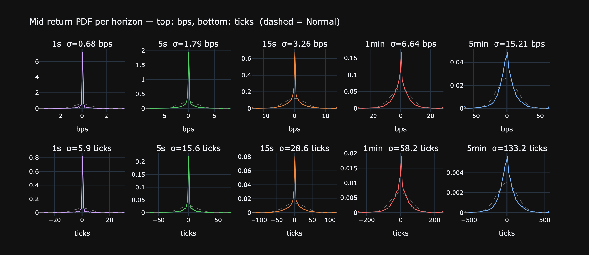

### 7.2 Range of mid within window

Внутри окна Δt — какова амплитуда (max−min) mid в bps? Это «то, что мы пропустим, если будем смотреть на снимок раз в Δt».

```python
mid_grid = lobs.set_index('ts')['mid'].resample('100ms').last().ffill()
windows  = [(5,'500ms'), (10,'1s'), (50,'5s'), (300,'30s'), (600,'1min')]

rows = []
for w, label in windows:
    rmax = mid_grid.rolling(w).max()
    rmin = mid_grid.rolling(w).min()
    rng  = (rmax - rmin) / mid_grid * 1e4  # bps
    rows.append({
        'window':   label,
        'median (bps)': round(rng.median(), 2),
        'p90':         round(rng.quantile(0.90), 2),
        'p99':         round(rng.quantile(0.99), 2),
        'max':         round(rng.max(), 1),
    })
pd.DataFrame(rows)
```

**Result:**
```
  window  median (bps)    p90    p99    max
0  500ms          0.00   0.28   1.78   50.7
1     1s          0.00   0.67   2.85   58.9
2     5s          0.35   2.81   7.52   96.3
3    30s          2.93   8.73  20.11  110.3
4   1min          5.01  13.02  31.16  110.3
```

### 7.3 Microprice predictiveness

Корреляция `microprice − mid` (текущий «edge» в копейках от баланса L1) с `mid_{t+k} − mid_t` (будущим движением). При k=1 — насколько microprice предсказывает следующий снапшот.

```python
edge = lobs['microprice'] - lobs['mid']
rows = []
for k in [1, 5, 10, 30, 100]:
    fwd = lobs['mid'].shift(-k) - lobs['mid']
    rows.append({'horizon (snapshots)': k,
                 'corr(edge, Δmid_+k)': round(edge.corr(fwd), 3)})
print(pd.DataFrame(rows).to_string(index=False))
```

**Output:**
```
 horizon (snapshots)  corr(edge, Δmid_+k)
                   1                0.135
                   5                0.087
                  10                0.067
                  30                0.048
                 100                0.035
```

## 8. Fee economics

Сколько реально стоит торговать активом после rebate? `fee < 0` — top-tier maker rebate.

```python
maker_legs = trades[~trades['crossed']]
taker_legs = trades[ trades['crossed']]

# Notional (USDC) traded
trades['notional'] = trades['sz'] * trades['px']
v_maker = trades.loc[~trades['crossed'], 'notional'].sum()
v_taker = trades.loc[ trades['crossed'], 'notional'].sum()

# Effective rate per side: total fee / total notional, in bps
eff_maker = maker_legs['fee'].sum() / v_maker * 1e4
eff_taker = taker_legs['fee'].sum() / v_taker * 1e4

# Rebate share
rebate_count_share  = (maker_legs['fee'] < 0).mean() * 100
rebate_volume_share = maker_legs.loc[maker_legs['fee']<0, 'notional'].sum() \
                    / maker_legs['notional'].sum() * 100

stats = pd.DataFrame({'value': [
    f'{eff_maker:+.3f} bps',
    f'{eff_taker:+.3f} bps',
    f'{eff_maker + eff_taker:+.3f} bps',
    f'{rebate_count_share:.1f} %',
    f'{rebate_volume_share:.1f} %',
    f'{maker_legs.loc[maker_legs["fee"]<0, "fee"].mean():.4f} USDC',
    f'{taker_legs["fee"].mean():.4f} USDC',
]}, index=[
    'Effective maker rate (volume-weighted)',
    'Effective taker rate (volume-weighted)',
    'Round-trip cost (maker+taker)',
    'Maker fills with rebate (count)',
    'Maker volume on rebate',
    'Avg rebate per maker fill',
    'Avg taker fee',
])
print(stats.to_string())
```

**Output:**
```
                                               value
Effective maker rate (volume-weighted)    +0.250 bps
Effective taker rate (volume-weighted)    +3.363 bps
Round-trip cost (maker+taker)             +3.613 bps
Maker fills with rebate (count)               37.1 %
Maker volume on rebate                        50.3 %
Avg rebate per maker fill               -0.0146 USDC
Avg taker fee                            0.1471 USDC
```

```python
# Distribution of fee values for both sides
fig = make_subplots(rows=1, cols=2, subplot_titles=[
    'Maker fee (rebate < 0, basic > 0)', 'Taker fee'])
fig.add_trace(go.Histogram(x=maker_legs['fee'].clip(-0.5, 0.5),
                          nbinsx=80, marker_color='#d2a8ff'), 1, 1)
fig.add_vline(x=0, line_dash='dot', line_color='gray', row=1, col=1)
fig.add_trace(go.Histogram(x=taker_legs['fee'].clip(0, 1.0),
                          nbinsx=80, marker_color='#f0883e'), 1, 2)
fig.update_xaxes(title_text='USDC', row=1, col=1)
fig.update_xaxes(title_text='USDC', row=1, col=2)
fig.update_layout(template=THEME, height=350, showlegend=False)
show(fig)
```

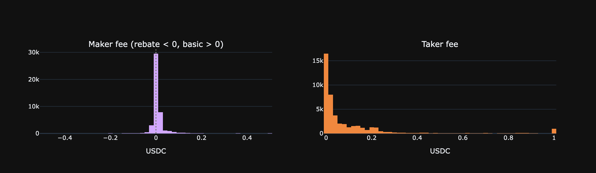

## 9. Funding rate

Исторические hourly funding rates за апрель 2026 через Hyperliquid API.
Funding платится **каждый час** (не раз в 8h); формула: `F_8h = premium + clamp(0.01% − premium, ±0.05%)`, hourly = F_8h / 8.

```python
import urllib.request, json as _json, ssl as _ssl

_ctx = _ssl.create_default_context()
_ctx.check_hostname = False
_ctx.verify_mode = _ssl.CERT_NONE

_start = int(pd.Timestamp('2026-04-01', tz='UTC').timestamp() * 1000)
_end   = int(pd.Timestamp('2026-04-11', tz='UTC').timestamp() * 1000)

_req = urllib.request.Request(
    'https://api.hyperliquid.xyz/info',
    data=_json.dumps({'type': 'fundingHistory', 'coin': ASSET_NAME,
                      'startTime': _start, 'endTime': _end}).encode(),
    headers={'Content-Type': 'application/json'}, method='POST')
with urllib.request.urlopen(_req, timeout=15, context=_ctx) as _r:
    _raw = _json.loads(_r.read())

fund = pd.DataFrame(_raw)
fund['ts']   = pd.to_datetime(fund['time'], unit='ms', utc=True)
fund['rate'] = fund['fundingRate'].astype(float) * 1e4   # bps/hr
fund['prem'] = fund['premium'].astype(float) * 1e4       # bps
fund = fund.sort_values('ts').reset_index(drop=True)

print(f'Records: {len(fund)}  ({fund.ts.min().date()} – {fund.ts.max().date()})')
print(fund[['rate','prem']].describe().round(4).to_string())
```

**Output:**
```
Records: 240  (2026-04-01 – 2026-04-10)
           rate      prem
count  240.0000  240.0000
mean     0.1093   -2.1324
std      0.0463    1.6408
min     -0.1439   -6.1514
25%      0.1250   -3.3306
50%      0.1250   -2.0009
75%      0.1250   -0.9348
max      0.1250    2.1662
```

```python
fig = make_subplots(rows=2, cols=1, shared_xaxes=True,
    subplot_titles=['Hourly funding rate (bps/hr)', 'Mark−Oracle premium (bps)'],
    row_heights=[0.5, 0.5])

fig.add_trace(go.Scatter(x=fund['ts'], y=fund['rate'], mode='lines',
    line=dict(color='#d2a8ff', width=1), name='funding rate'), row=1, col=1)
fig.add_hline(y=0,       line_dash='dot', line_color='gray', row=1, col=1)
fig.add_hline(y=0.00125, line_dash='dash', line_color='#f0883e',
              annotation_text='floor 0.00125 bps/hr', annotation_position='right',
              row=1, col=1)

fig.add_trace(go.Scatter(x=fund['ts'], y=fund['prem'], mode='lines',
    line=dict(color='#51cf66', width=1), name='premium'), row=2, col=1)
fig.add_hline(y=0, line_dash='dot', line_color='gray', row=2, col=1)

fig.update_yaxes(title_text='bps/hr', row=1, col=1)
fig.update_yaxes(title_text='bps',    row=2, col=1)
fig.update_layout(template=THEME, height=420, showlegend=False,
    title=f'{ASSET_NAME}-USDC perp funding rate & premium — Apr 2026')
show(fig)
```

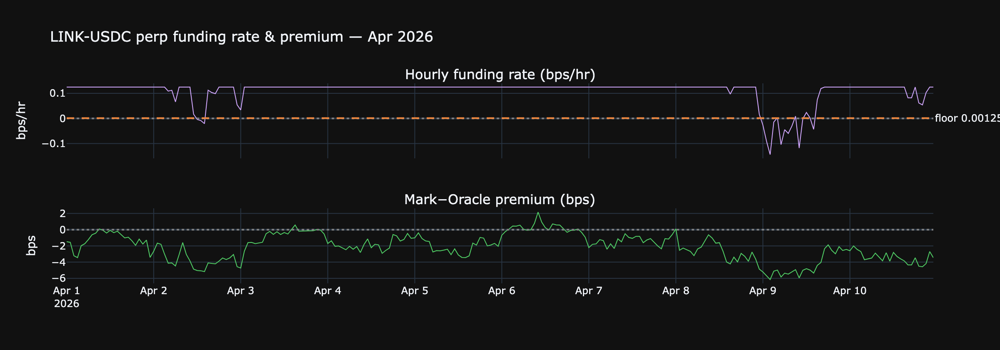

```python
floor_bps   = 0.00125   # theoretical floor
neg_pct     = (fund['rate'] < 0).mean() * 100
below_floor = (fund['rate'] < floor_bps).mean() * 100

print(f'Negative rate (shorts pay longs): {neg_pct:.1f}% of hours')
print(f'Below theoretical floor ({floor_bps} bps/hr): {below_floor:.1f}% of hours')
print(f'Mean rate: {fund["rate"].mean():.4f} bps/hr  = {fund["rate"].mean()*24:.3f} bps/day')
print(f'Mean premium: {fund["prem"].mean():.2f} bps  (persistently negative = mark < oracle)')

# Cumulative funding on a +1 symbol long position
price   = lobs['mid'].mean()
cum_usdc    = (fund['rate'] / 1e4 * price).cumsum()   # USDC per symbol

fig = make_subplots(rows=1, cols=2,
    subplot_titles=['Funding rate distribution', f'Cumulative cost: +1 {ASSET_NAME} long (USDC)'])

c, e = np.histogram(fund['rate'], bins=40, density=True)
fig.add_trace(go.Bar(x=0.5*(e[:-1]+e[1:]), y=c, marker_color='#d2a8ff',
    name='rate dist'), row=1, col=1)
fig.add_vline(x=0,          line_dash='dot', line_color='gray', row=1, col=1)
fig.add_vline(x=floor_bps,  line_dash='dash', line_color='#f0883e', row=1, col=1)

fig.add_trace(go.Scatter(x=fund['ts'], y=cum_usdc, mode='lines',
    line=dict(color='#51cf66', width=2), name='cumulative'), row=1, col=2)
fig.add_hline(y=0, line_dash='dot', line_color='gray', row=1, col=2)

fig.update_xaxes(title_text='bps/hr', row=1, col=1)
fig.update_yaxes(title_text='USDC earned (+) / paid (−)', row=1, col=2)
fig.update_layout(template=THEME, height=360, showlegend=False,
    title=f'Funding distribution & cumulative P&L for +1 {ASSET_NAME} long over {len(fund)} hours')
show(fig)
```

**Output:**
```
Negative rate (shorts pay longs): 5.8% of hours
Below theoretical floor (0.00125 bps/hr): 5.8% of hours
Mean rate: 0.1093 bps/hr  = 2.623 bps/day
Mean premium: -2.13 bps  (persistently negative = mark < oracle)
```

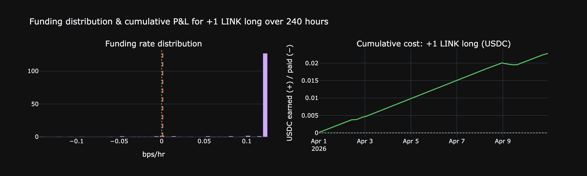

```python
# Intraday pattern — avg funding rate by hour of day UTC
fund['hour'] = fund['ts'].dt.hour
by_hour = fund.groupby('hour')[['rate', 'prem']].mean()

fig = make_subplots(rows=1, cols=2,
    subplot_titles=['Avg funding rate by hour UTC', 'Avg premium by hour UTC'])
fig.add_trace(go.Bar(x=by_hour.index, y=by_hour['rate'],
    marker_color='#d2a8ff', name='rate'), row=1, col=1)
fig.add_trace(go.Bar(x=by_hour.index, y=by_hour['prem'],
    marker_color='#51cf66', name='premium'), row=1, col=2)
fig.add_hline(y=0, line_dash='dot', line_color='gray', row=1, col=1)
fig.add_hline(y=0, line_dash='dot', line_color='gray', row=1, col=2)
fig.update_xaxes(title_text='hour (UTC)', dtick=4)
fig.update_yaxes(title_text='bps/hr', row=1, col=1)
fig.update_yaxes(title_text='bps',    row=1, col=2)
fig.update_layout(template=THEME, height=340, showlegend=False,
    title='Intraday funding pattern — averaged across Apr 2026')
show(fig)
```

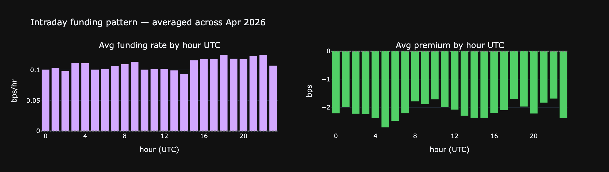

## 10. Market participants

Уникально для DEX — мы видим адреса всех контрагентов. Кто и в каких пропорциях торгует актив.

### 10.1 Top users by volume

```python
trades['notional'] = trades['sz'] * trades['px']
u = trades.groupby('user').agg(
    n_legs=('sz', 'count'),
    n_taker=('crossed', 'sum'),
    sz_total=('sz', 'sum'),
    notional=('notional', 'sum'),
    fee_total=('fee', 'sum'),
)
u['n_maker']      = u['n_legs'] - u['n_taker']
u['maker_share']  = u['n_maker'] / u['n_legs']
u['rebate_total'] = (-u['fee_total']).clip(lower=0)  # if net negative fee = received rebate

top = u.sort_values('notional', ascending=False).head(20).copy()
top['notional_M']    = (top['notional'] / 1e6).round(2)
top['maker_share_%'] = (top['maker_share']*100).round(1)
top[['n_legs','n_taker','n_maker','maker_share_%','notional_M','fee_total']] \
    .rename(columns={'notional_M':'notional ($M)', 'fee_total':'net fee (USDC)'})
```

**Result:**
```
                                            n_legs  n_taker  n_maker  \
user                                                                   
0xa33a4a057334c7811ad5f45f3c4f0dfa3d081ff8    1242      956      286   
0x6ba889db7f923622d3548f621ecc2054b80c1817    6512     1408     5104   
0x727956612a8700627451204a3ae26268bd1a1525    8778     6266     2512   
0x654016a8c9fcf0c4cb7ed6078aba21f7f399f7b7     883      769      114   
0xd02928c445d780ea954fe0b6f0be0f6cb9727678    2479     2042      437   
0x010461c14e146ac35fe42271bdc1134ee31c703a    5727     3110     2617   
0xf9109ada2f73c62e9889b45453065f0d99260a2d    1434       24     1410   
0x31ca8395cf837de08b24da3f660e77761dfb974b    5345     3032     2313   
0x15094c3ec74e8a43c082042815e0c135deebb152     856       18      838   
0x48ea62a2cc8391fbbe210e8ee89db573a8ec145f    2313       23     2290   
0x6beffb9bec3364ae579fa7cb864effefa7bf2695    3755     3755        0   
0x0871deb34bfd2052b1c10dc4f6c0912a2a47e927     158        4      154   
0x7e698eea0709e4a0dbbd790fc493d60691801157    1127        0     1127   
0xd0bf47dc3a7a0d931ee40174b9fa032cb113ede2     220      220        0   
0x2a72b57dea119cc0bac14df798f9e9b8b148267c     739       82      657   
0x0bfd7d7721f4c116e853c18ea7998e1cc2350a7d     987      728      259   
0x57dd78cd36e76e2011e8f6dc25cabbaba994494b    1265      204     1061   
0x7717a7a245d9f950e586822b8c9b46863ed7bd7e    1572      132     1440   
0x76c2cd1b8a249f465f8445c455cb78e0eed36f1e    1245     1245        0   
0xf032648dfd22c4d81588bd83e09ab89cfe816705     804      383      421   

                                            maker_share_%  notional ($M)  \
user                                                                       
0xa33a4a057334c7811ad5f45f3c4f0dfa3d081ff8           23.0           2.75   
0x6ba889db7f923622d3548f621ecc2054b80c1817           78.4           2.68   
0x727956612a8700627451204a3ae26268bd1a1525           28.6           2.38   
0x654016a8c9fcf0c4cb7ed6078aba21f7f399f7b7           12.9           1.99   
0xd02928c445d780ea954fe0b6f0be0f6cb9727678           17.6           1.66   
0x010461c14e146ac35fe42271bdc1134ee31c703a           45.7           1.44   
0xf9109ada2f73c62e9889b45453065f0d99260a2d           98.3           1.40   
0x31ca8395cf837de08b24da3f660e77761dfb974b           43.3           1.31   
0x15094c3ec74e8a43c082042815e0c135deebb152           97.9           1.28   
0x48ea62a2cc8391fbbe210e8ee89db573a8ec145f           99.0           1.18   
0x6beffb9bec3364ae579fa7cb864effefa7bf2695            0.0           1.04   
0x0871deb34bfd2052b1c10dc4f6c0912a2a47e927           97.5           0.92   
0x7e698eea0709e4a0dbbd790fc493d60691801157          100.0           0.92   
0xd0bf47dc3a7a0d931ee40174b9fa032cb113ede2            0.0           0.66   
0x2a72b57dea119cc0bac14df798f9e9b8b148267c           88.9           0.59   
0x0bfd7d7721f4c116e853c18ea7998e1cc2350a7d           26.2           0.58   
0x57dd78cd36e76e2011e8f6dc25cabbaba994494b           83.9           0.55   
0x7717a7a245d9f950e586822b8c9b46863ed7bd7e           91.6           0.51   
0x76c2cd1b8a249f465f8445c455cb78e0eed36f1e            0.0           0.44   
0xf032648dfd22c4d81588bd83e09ab89cfe816705           52.4           0.41   

                                            net fee (USDC)  
user                                                        
0xa33a4a057334c7811ad5f45f3c4f0dfa3d081ff8      126.891700  
0x6ba889db7f923622d3548f621ecc2054b80c1817      153.039704  
0x727956612a8700627451204a3ae26268bd1a1525      278.740118  
0x654016a8c9fcf0c4cb7ed6078aba21f7f399f7b7      667.375814  
0xd02928c445d780ea954fe0b6f0be0f6cb9727678      126.655444  
0x010461c14e146ac35fe42271bdc1134ee31c703a        0.000000  
0xf9109ada2f73c62e9889b45453065f0d99260a2d      -33.662674  
0x31ca8395cf837de08b24da3f660e77761dfb974b        0.000000  
0x15094c3ec74e8a43c082042815e0c135deebb152      -36.122251  
0x48ea62a2cc8391fbbe210e8ee89db573a8ec145f       -2.002850  
0x6beffb9bec3364ae579fa7cb864effefa7bf2695      431.667787  
0x0871deb34bfd2052b1c10dc4f6c0912a2a47e927      112.660568  
0x7e698eea0709e4a0dbbd790fc493d60691801157       29.381383  
0xd0bf47dc3a7a0d931ee40174b9fa032cb113ede2      284.650118  
0x2a72b57dea119cc0bac14df798f9e9b8b148267c      -11.220429  
0x0bfd7d7721f4c116e853c18ea7998e1cc2350a7d       60.689737  
0x57dd78cd36e76e2011e8f6dc25cabbaba994494b       13.527336  
0x7717a7a245d9f950e586822b8c9b46863ed7bd7e       22.018994  
0x76c2cd1b8a249f465f8445c455cb78e0eed36f1e      142.128738  
0xf032648dfd22c4d81588bd83e09ab89cfe816705       99.965264
```

### 10.2 Maker / taker mix per user

Каждая точка — кошелёк. По X — общий объём (log-scale), по Y — доля maker fills. Реальные MM сидят в правом верхнем углу (большой объём + 90%+ maker).

```python
# Filter to users with meaningful activity to declutter
u_plot = u[u['n_legs'] >= 50].copy()

fig = go.Figure()
fig.add_trace(go.Scatter(
    x=u_plot['notional'], y=u_plot['maker_share']*100,
    mode='markers',
    marker=dict(color=u_plot['n_legs'], colorscale='Magma',
                size=6, opacity=0.6,
                colorbar=dict(title='# fills')),
    text=u_plot.index,
    hovertemplate='user: %{text}<br>volume: $%{x:,.0f}<br>maker: %{y:.1f}%'
))
fig.update_xaxes(type='log', title_text='notional volume (USDC, log)')
fig.update_yaxes(title_text='maker share (%)', range=[0, 105])
fig.update_layout(template=THEME, height=420,
    title=f'Per-user maker share vs volume  (N = {len(u_plot):,} users with ≥50 fills)')
show(fig)
```

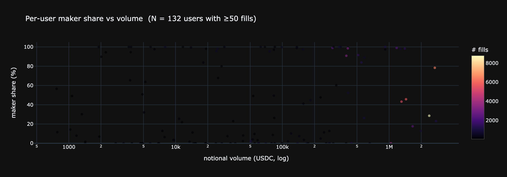

### 10.3 Concentration of activity

```python
sorted_v = u['notional'].sort_values().values
N        = len(sorted_v)
total    = sorted_v.sum()
top5     = u['notional'].nlargest(5).sum()  / total
top20    = u['notional'].nlargest(20).sum() / total
top100   = u['notional'].nlargest(100).sum() / total

# Gini
gini = (2 * np.sum(np.arange(1, N+1) * sorted_v) / (N * total)) - (N+1)/N

stats = pd.DataFrame({'value': [
    f'{N:,}',
    f'{top5*100:.1f} %',
    f'{top20*100:.1f} %',
    f'{top100*100:.1f} %',
    f'{gini:.3f}',
]}, index=['Unique users', 'Top-5 share', 'Top-20 share',
          'Top-100 share', 'Gini of volume'])
print(stats.to_string())
```

**Output:**
```
                 value
Unique users     2,515
Top-5 share     28.6 %
Top-20 share    61.7 %
Top-100 share   87.5 %
Gini of volume   0.955
```

```python
# Lorenz curve
cum_users = np.arange(1, N+1) / N * 100
cum_vol   = np.cumsum(sorted_v) / total * 100

fig = go.Figure()
fig.add_trace(go.Scatter(x=cum_users, y=cum_vol, mode='lines',
                         line=dict(color='#d2a8ff'), name='Lorenz'))
fig.add_trace(go.Scatter(x=[0,100], y=[0,100], mode='lines',
                         line=dict(color='gray', dash='dot'),
                         name='perfect equality'))
fig.update_layout(template=THEME, height=380,
    title=f'Lorenz curve of user volume  —  Gini = {gini:.3f}',
    xaxis_title='% of users (sorted by volume)',
    yaxis_title='% of cumulative volume')
show(fig)
```

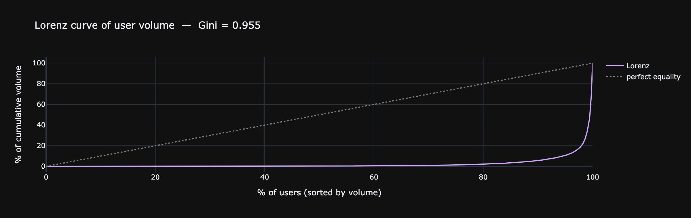

### 10.4 Open vs Close flow

`dir` различает открытие и закрытие позиции. Баланс между ними — чистый flow leverage on/off.

```python
flow = trades.groupby('dir').agg(n=('sz','count'),
                                 vol=('notional','sum'))
flow['count_%']  = (flow['n']  / flow['n'].sum()  * 100).round(1)
flow['volume_%'] = (flow['vol']/ flow['vol'].sum()* 100).round(1)
flow['vol_M']    = (flow['vol']/1e6).round(1)

print(flow[['n','count_%','vol_M','volume_%']]
      .rename(columns={'vol_M':'volume ($M)'}).to_string())

opens  = flow.loc[flow.index.str.startswith('Open'),  'vol'].sum()
closes = flow.loc[flow.index.str.startswith('Close'), 'vol'].sum()
print(f'\nOpen:  ${opens/1e6:.1f}M  ({opens/(opens+closes)*100:.1f}%)')
print(f'Close: ${closes/1e6:.1f}M  ({closes/(opens+closes)*100:.1f}%)')
```

**Output:**
```
                  n  count_%  volume ($M)  volume_%
dir                                                
Close Long    12941     14.2          6.1      15.2
Close Short   30178     33.0         12.3      30.9
Long > Short   1318      1.4          0.8       2.0
Open Long     14242     15.6          6.9      17.4
Open Short    31464     34.4         13.1      32.8
Short > Long   1303      1.4          0.7       1.8

Open:  $20.1M  (52.1%)
Close: $18.4M  (47.9%)
```

